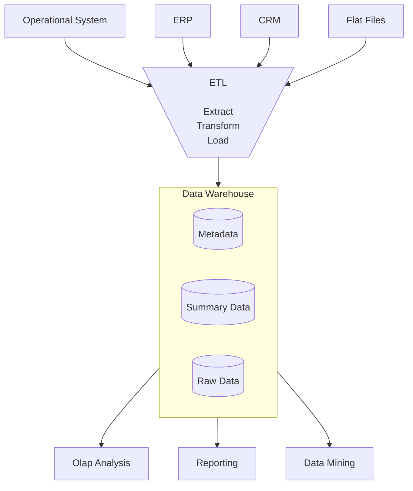

## ETL : Extract & Transform & Load

- ETL(추출, 변환, 적재)는 **다양한 source data를 대형 중앙 집중식 repository(data warehouse)에 결합하는 과정**입니다.
    - ETL은 raw data(원시 자료)를 정리 및 구성해서 storage, data 분석, 기계 학습(ML, Machine Learning) 용도로 준비하기 위한 bisuness rule set입니다.
    - 사용자는 data 분석(business 의사 결정의 결과 예측, report 및 dashboard 생성, 운영 비효율성 저감 등)을 통해 특정 business intelligence 요구 사항을 해결할 수 있습니다.
    - ETL process는 data 통합과 분석을 위한 핵심적인 data pipeline 구축 방법론입니다.

- ETL은 **Extract(추출), Transform(변환), Load(적재)의 약자**입니다.
    - **Extract** (추출) : 다양한 source system에서 data를 추출하는 단계입니다.
        - database, file, API, sensor 등 여러 source에서 data를 가져옵니다.
    - **Transform** (변환) : 추출된 data를 목적에 맞게 변환하는 단계입니다.
        - data 정제, 형식 변환, 유효성 검증, 집계, filtering 등의 작업이 이루어집니다.
    - **Load** (적재) : 변환된 data를 최종 목적지에 저장하는 단계입니다.
        - data warehouse, data mart, database 등에 data를 저장합니다.

