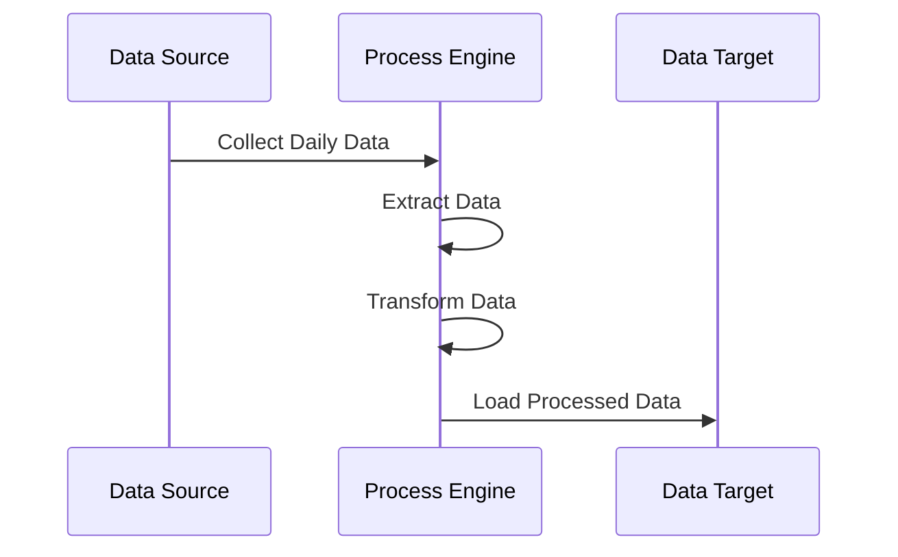
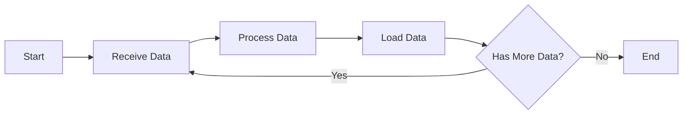
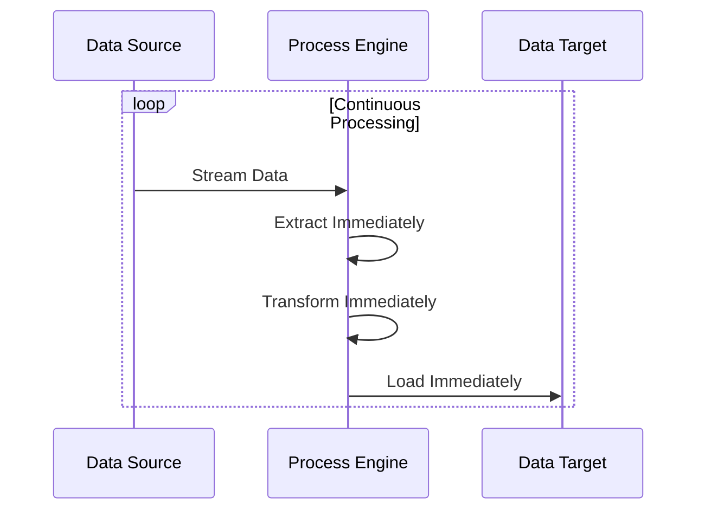
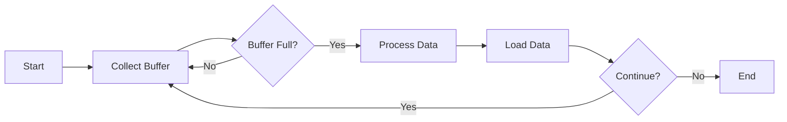
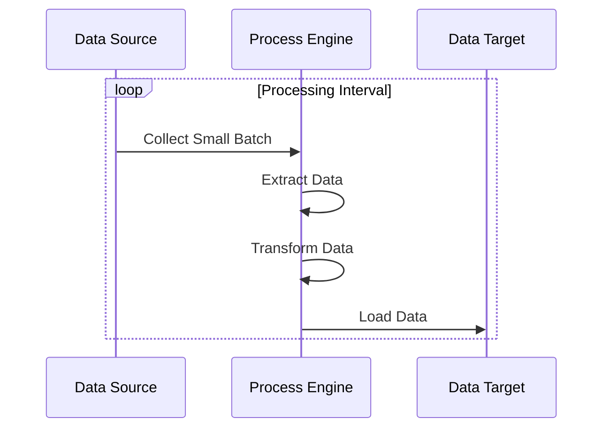

## ETL : Extract & Transform & Load

- ETL(추출, 변환, 적재)는 **다양한 source data를 대형 중앙 집중식 repository(data warehouse)에 결합하는 과정**입니다.
    - ETL은 raw data(원시 자료)를 정리 및 구성해서 storage, data 분석, 기계 학습(ML, Machine Learning) 용도로 준비하기 위한 bisuness rule set입니다.
    - 사용자는 data 분석(business 의사 결정의 결과 예측, report 및 dashboard 생성, 운영 비효율성 저감 등)을 통해 특정 business intelligence 요구 사항을 해결할 수 있습니다.
    - ETL process는 data 통합과 분석을 위한 핵심적인 data pipeline 구축 방법론입니다.

- ETL은 **Extract(추출), Transform(변환), Load(적재)의 약자**입니다.
    - **Extract** (추출) : 다양한 source system에서 data를 추출하는 단계입니다.
        - database, file, API, sensor 등 여러 source에서 data를 가져옵니다.
    - **Transform** (변환) : 추출된 data를 목적에 맞게 변환하는 단계입니다.
        - data 정제, 형식 변환, 유효성 검증, 집계, filtering 등의 작업이 이루어집니다.
    - **Load** (적재) : 변환된 data를 최종 목적지에 저장하는 단계입니다.
        - data warehouse, data mart, database 등에 data를 저장합니다.

---

## 여러 ETL 처리 방식

- 각 방식은 business 요구 사항, data 특성, system resource 등을 고려하여 선택됩니다.
    - 실제로는 한 조직 내에서도 여러 방식을 혼용하여 사용하는 것이 일반적입니다.

### Batch Processing

- 가장 전통적인 방식으로, **정해진 시간에 대량의 data를 처리**합니다.
    - 예를 들어, 매일 자정에 하루 동안 쌓인 data를 처리하거나, 매주 일요일에 주간 data를 처리하는 방식입니다.
- 대규모 data 처리에 효율적이며, resource 사용을 최적화할 수 있습니다.

### Stream Processing

- **data가 생성되는 즉시 처리**하는 방식입니다.
    - 실시간 stream으로 처리합니다.
- 실시간 분석이나 즉각적인 의사 결정이 필요한 경우에 사용됩니다.
- 최근에는 기술의 발전으로 실시간 ETL의 채택이 증가하고 있습니다.

### Micro-batch Processing

- **data를 작은 단위로 모아서 몇 분 또는 몇 시간 간격으로 처리**합니다.
    - batch와 실시간 처리의 중간 형태입니다.
- 실시간성과 처리 효율성 사이의 균형을 맞추는 방식입니다.

---

## ELT : Extract, Load, Transform

- **ELT**(추출, 적재, 변환)은 **ETL의 적재와 변환 작업의 순서를 역순**으로 바꾼 **ETL의 확장 기능**입니다.
    - data를 처리하기 전에 대상 system에 직접 data를 적재(load)해둡니다.

- 처음에 더 많은 정의가 필요한 ETL process에 비해서, **ELT는 분석 process가 비교적 자유로운 편**입니다.
    - ETL에서 대상 data의 유형/구조/관계를 정의하려면, 처음부터 분석이 실행되어야 합니다.
    - **ELT는 분석 단계를 나중으로** 미룰 수 있기 때문에, 상대적으로 **더 유연한 처리가 가능**합니다.
        - 대상 data를 적재하는 warehouse 내에 data mapping 기능이 있으므로, 중간 staging 영역이 굳이 필요하지 않습니다.
    - 따라서, 최근에는 ELT를 표준으로 채택하여 사용하는 추세이며, ETL은 legacy database를 warehouse에 적재할 때 주로 사용합니다.

- ELT는 **빈번하게 load해야 하는 대량의 비정형 dataset에 적합**합니다.
    - **일단 data 추출과 저장**을 모두 마친 후, **나중에 분석**을 위한 계획을 수립할 수 있으므로, **big data 관리에 이상적**입니다.
    - 대량의 **변환 작업은 마지막 분석 단계에서 수행**하도록 남겨두고, 최소한으로만 가공한 원시(raw) data를 data warehouse에 적재해두는 데 초점을 맞춥니다.

---

## Reference

- <https://aws.amazon.com/ko/what-is/etl>

