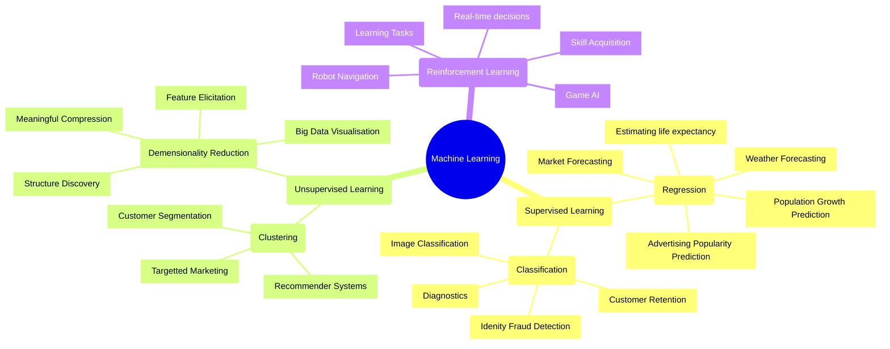
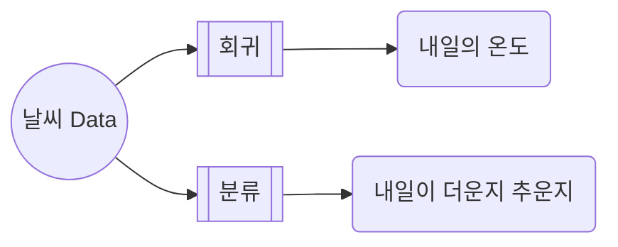

- 기계 학습은 computer가 스스로 학습하여 문제를 해결하는 algorithm을 연구하는 분야입니다.
    - computer는 data를 통해 학습하고, 학습 결과를 바탕으로 예측이나 결정을 내릴 수 있습니다.

- 기계 학습의 기본 원리는 data를 통해 model을 학습(train)시키고, 그 model을 통해 새로운 data에 대한 결과를 예측(test)하는 것입니다.
    - 학습 data는 입력 data와 그에 대한 정답, 즉 label로 이루어져 있습니다.

- 기계 학습이 가지는 다양한 장점과 특성 때문에, 기계 학습은 많은 분야에서 활용되고 있습니다. 
    - 기계 학습은 big data를 다루는 데에 유용하며, 사람이 해결하기 어려운 복잡한 문제를 해결하는 데에도 활용됩니다.
    - 기계 학습을 통해 예측 model을 만들 수 있어, 특정 결과를 예측하는 데에 활용할 수 있습니다.
    - 예를 들어, 환자의 건강 상태 예측(의료), 주가 예측(금융), 자율 주행 자동차, 음성 인식, 얼굴 인식 등.

---

## 기계 학습의 종류

- 기계 학습은 크게 지도 학습, 비지도 학습, 강화 학습으로 나뉩니다.

### 지도 학습 (Supervised Learning)

- 지도 학습은 label이 있는 학습 data를 사용하는 학습 방법입니다.
- 입력 data와 그에 대한 정답, 즉 label이 함께 주어지며, 이를 통해 model을 학습시킵니다.
- 이렇게 학습된 model은 새로운 입력 data에 대한 예측을 할 수 있습니다.

#### 지도 학습의 사례 – 회귀 (Regression)

- 회귀는 연속적인 값을 예측하는 것입니다.
- 학습한 data를 바탕으로 물건의 가격, 학생의 성적 등을 예측할 수 있습니다.

#### 지도 학습의 사례 – 분류 (Classification)

- 정답이 있는 data로 학습을 하기 때문에 이를 바탕으로 분류 작업을 할 수 있습니다.
- 결과를 두 가지로 분류하는 경우를 이진 분류(binary classification), 그보다 많은 결과를 분류하는 경우를 다중 분류(multiclass classification)라고 합니다.

### 비지도 학습 (Unsupervised Learning)

- 비지도 학습은 label이 없는 학습 data를 사용하는 학습 방법입니다.
- 입력 data만 주어지며, 이를 통해 data의 pattern이나 구조를 찾아내는 것이 목표입니다.
- 이렇게 찾아낸 pattern이나 구조를 통해 새로운 입력 data에 대한 해석을 할 수 있습니다.

#### 비지도 학습의 사례 – 군집 (Clustering)

- data에서 특징을 찾아내 여러 group으로 묶는 군집화를 할 수 있습니다.

#### 비지도 학습의 사례 – 차원 축소 (Dimension Reduction)

- 차원 축소는 data의 특징을 줄이는 작업입니다.
- data를 설명하는 여러 특징이 있을 때, 이 data를 가장 잘 표현할 수 있는 특징들을 추리는 것입니다.

### 강화 학습 (Reinforcement Learning)

- 강화 학습은 (비)지도 학습과는 다르게 **고정된 data를 통해 학습하지 않습니다.**
    - 기계의 경험을 통해 직접 만들어 낸 dataset(상태, 행동, 보상)을 통해 학습합니다.
        - 기계가 특정 상태(state)에서 행동(action)을 취하면 환경으로부터 보상(reward)을 받습니다.
    - 그래서 환경에서 주어지는 보상과 기계 자신이 환경을 탐험하는 방법에 따라 학습 결과가 크게 달라질 수 있습니다.
    - 보상 설계를 잘 할 수 있다면 방대한 data 없이 기계 스스로 학습하게 하는 것이 가능합니다.

- 강화 학습에서 환경에서 주어지는 보상과 그 보상에 대한 처리를 설계하고 정의하는 것이 어렵기 때문에 **(비)지도 학습보다 학습 난이도가 높습니다.**
    - 예를 들어, 신뢰 할당 문제(credit assignment problem)와 탐색-이용 dilemma(exploration-exploitation dilemma) 등.
    

---

## Reference

- <https://www.ascentkorea.com/%EB%A8%B8%EC%8B%A0-%EB%9F%AC%EB%8B%9Dmachine-learning%EC%9D%B4%EB%9E%80-%EB%AC%B4%EC%97%87%EC%9D%B8%EA%B0%80/>
- <https://towardsdatascience.com/introduction-to-machine-learning-for-beginners-eed6024fdb08>
- <https://namu.wiki/w/%EA%B0%95%ED%99%94%ED%95%99%EC%8A%B5>
