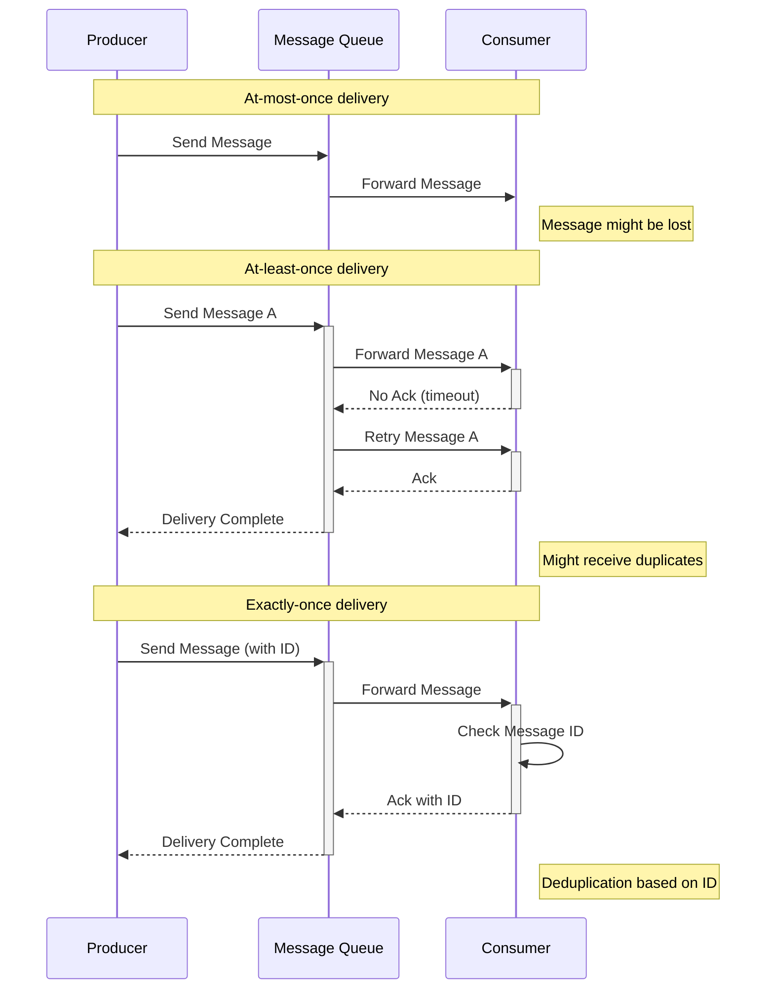
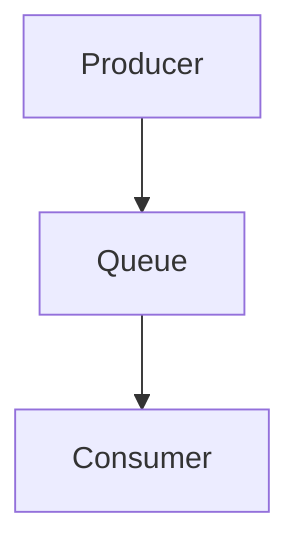
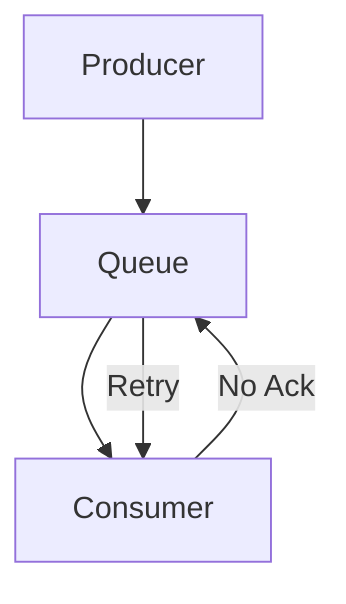
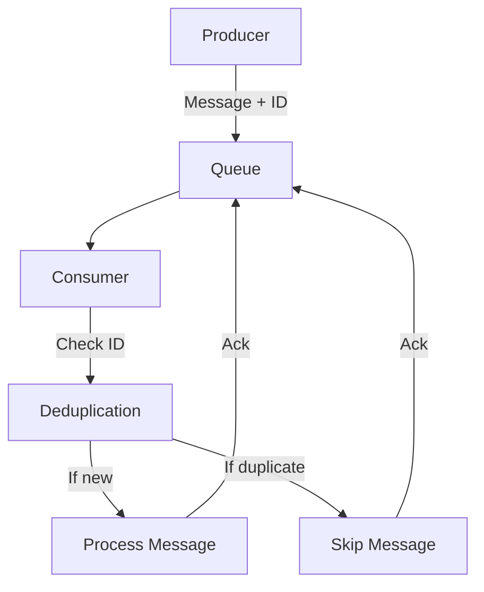

## Message/Event 전달 보증 수준 (Event Delivery Guarantees)

- Message Queue의 message 처리 보장 방식은 크게 At Most Once(최대 1회), At Least Once(최소 1회), Exactly Once(정확히 1회) 전달 방식이 있으며, 이는 **message 발행자(Producer)가 보낸 message를 수신자(Consumer)가 받을 때 몇 번이나 전달되는지를 보장하는 수준**을 의미합니다.

- 각 방식은 사용 사례와 요구 사항에 따라 적절히 선택하여 사용해야 합니다.
    - data의 중요도, system의 복잡성, 성능 요구 사항 등을 고려하여 결정하면 됩니다.

### At-most-once (최대 한 번 전달)

- **message가 최대 1회만 전달되는 것을 보장하는 방식**입니다.
    - message가 한 번만 전송되며, 수신 확인을 하지 않습니다.
    - 처리 속도가 빠르고 구현이 단순하지만, 메세지 손실 가능성이 있습니다.

- message가 전달되지 않을 수 있으나, 중복 전달은 절대 발생하지 않습니다.

- data의 일부 손실이 허용되는 경우에 사용합니다.
    - 실시간 monitoring data 처리, log 수집 system, 일시적인 data 손실이 허용되는 통계 system 등.

### At-least-once (최소 한 번 전달)

- **message가 반드시 1회 이상 전달되는 것을 보장하는 방식**입니다.
    - 수신 확인이 올 때까지 message를 계속 재전송합니다.
    - network 장애나 system 오류 발생 시에도 message 전달을 재시도합니다.

- message 손실을 방지할 수 있고, 구현이 비교적 단순하지만, message를 중복 전달할 가능성이 있습니다.
    - 중복 전달이 발생할 수 있으므로 수신자 측의 멱등성 처리가 필요합니다.
        - 멱등성(idempotence) : 동일한 요청이 여러 차례 반복되어 작업이 처리되어도 동일한 결과를 나타내는 특성.

- data 손실 방지가 중요하고 중복 처리가 가능한 경우에 사용합니다.
    - 금융 거래 system, 주문 처리 system, 중요 event 알림 system 등.

### Exactly-once (정확히 한 번 전달)

- **message가 정확히 1회만 전달되는 것을 보장하는 가장 엄격한 방식**입니다.
    - message를 정확히 한 번만 전달합니다.

- message를 손실과 중복 없이 완벽히 전달할 수 있지만, 구현이 매우 복잡하고, 성능 overhead가 발생할 수 있습니다.
    - Producer와 Consumer 모두 상태를 저장하여 관리합니다.

- data 손실 방지가 중요하고 중복 처리가 불가능한 경우에 사용합니다.
    - message의 중복이나 누락이 심각한 문제를 일으킬 수 있는 상황에서 반드시 한 번만 처리되어야 하는 경우에 사용합니다.
    - 결제 system, 계좌 이체 처리, 재고 관리, 법적 문서 처리 system 등.

---

## Message 처리 보장을 위한 핵심 Mechanism

- message 처리 보장을 위해 여러 핵심적인 mechanism을 적용할 수 있습니다.

1. **Message 영속성** (Message Persistence) : message를 Disk에 저장.
    - message를 Disk에 저장하여 system 장애 발생 시에도 data 손실을 방지합니다.
    - Memory와 Disk를 적절히 활용하여 성능과 안정성의 균형을 유지합니다.

2. **확인 응답 Mechanism** (Acknowledgment) : message 수신 및 처리 완료 확인.
    - message 수신 및 처리 완료를 명시적으로 확인합니다.
    - 자동 확인(Auto-ACK)과 수동 확인(Manual-ACK) 방식을 상황에 따라 선택할 수 있습니다.

3. **재시도 Mechanism** (Retry Mechanism) : 실패 시 재시도.
    - message 전달 실패 시 자동으로 재시도합니다.
    - 재시도 횟수와 간격을 설정하여 system 부하를 조절할 수 있습니다.

4. **실패 Message Queue** (Dead Letter Queue) : 실패 message 별도 보관.
    - 지속적인 처리 실패 message를 별도로 보관합니다.
    - 문제 분석과 수동 개입을 위한 message 보관소 역할을 수행합니다.

5. **Transaction 관리** (Transaction Management) : data 일관성 보장.
    - message 발행과 소비 과정에서 data 일관성을 보장합니다.
    - 분산 transaction을 통해 여러 system 간의 작업을 원자적으로 처리합니다.

