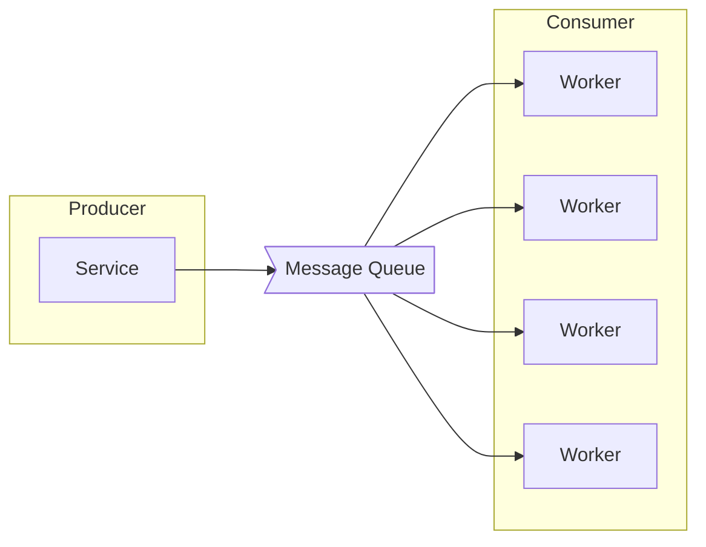

## Message Queue

- Message Queue에서 Queue란 선입선출(FIFO, First-In-First-Out) 구조를 가진 자료 구조입니다.
    - Queue 는 2개의 끝을 가지며 각각은 입구와 출구입니다.
    - 새로운 data는 입구로 들어오고 나가는 data는 출구에서 나갑니다.

- 따라서 Message Queue란, Queue라는 자료 구조를 채택해서 message를 전달하는 system입니다.

- Message Queue에는 Message Queue 외에도 **Producer**와 **Consumer**가 있습니다.
    - Message Queue를 통해 message를 전달하려면, message를 전달하는 부분과 message를 받는 부분이 필요합니다.
    - **message를 발행하고 전달하는 부분을 Producer**라고 하고, **message를 받아서 소비하는 부분을 Consumer**라고 합니다.
    - Message Queue는 Producer와 Consumer 사이에서 message 전달 역할을 하는 매개체입니다.

- Message Queue는 **MSA(Microservice Architecture) System**의 전반적인 **안정성, 확장성, 유연성**을 높이는 데 핵심적인 역할을 합니다.
    1. **Service 간 느슨한 결합** (Loose Coupling) : service 간 의존성이 낮아집니다.
        - microservice들이 직접 통신하지 않고 Message Queue를 통해 비동기적으로 통신하기 때문입니다.
        - 한 service의 장애가 다른 service로 전파되는 것을 방지할 수 있습니다.
    2. **System 안정성과 신뢰성** (Reliability) : system의 안정성을 높여줍니다.
        - 일시적인 traffic 폭주 시에도 Message Queue가 buffer 역할을 수행하기 때문입니다.
        - message 손실 없이 reliable한 data 전달을 보장합니다.
    3. **확장성** (Scalability) : service들을 독립적으로 확장할 수 있습니다.
        - 처리량에 따라 consumer를 동적으로 늘리거나 줄일 수 있습니다.

### MOM에 속하는 Message Queue

- MOM(Message Oriented Middleware)이란 **응용 software 간의 비동기적 data 통신을 위한 software**입니다.
    - MOM은 **비동기적인(asynchronous) 방식**을 이용해서 process 간의 data를 주고 받는 기능을 위한 system입니다.

- message를 전달하는 과정에서 **message를 보관, routing, 변환**할 수 있다는 장점을 가집니다.
    - **보관** : message의 backup 기능을 유지함으로써 지속성을 제공하며, 이 덕분에 송수신 측은 동시에 network 연결을 유지할 필요가 없습니다.
    - **Routing** : middleware 계층 자신이 직접 message routing을 수행하기 때문에, 하나의 message를 여러 수신자에게 배포할 수 있습니다.
    - **변환** : 송수신 측의 요구에 따라 전달하는 message를 변환할 수 있습니다.

- Message Queue는 message 지향 Middleware(MOM)를 구현한 system입니다.

### Message Broker vs Event Broker : Data 운반 방식의 차이

- Message Queue가 message 혹은 event가 송신되고 수신되는 하나의 통신 통로라고 한다면, **broker는 Message Queue에 message 혹은 event를 넣어주고 중개하는 역할을 하는 주체**입니다.
    - Message Queue와 broker는 엄연히 다른 개념입니다.
        - 하지만 broker가 하는 일이 곧 Message Queue service가 하는 일이기 때문에, Message Queue 자체가 Message Broker 혹은 Event Broker라고 이해하여도 무방합니다.

#### Message Broker

- Message Broker는 **Producer가 생산한 message를 Message Queue에 저장**하고, **저장된 message를 Consumer가 가져갈 수 있도록** 합니다.
- Message Broker는 Consumer가 Message Queue에서 data를 가져가게 되면 **짧은 시간 내에 Message Queue에서 삭제**된다는 특징이 있습니다.
- RabbitMQ, ActiveMQ, AWS SQS, Redis 등이 Message Broker입니다.

#### Event Broker

- Event Broker가 관리하는 data는 message가 아니라 **event**라고 합니다.
- Event Broker는 **Message Broker보다 더 많은 용량의 data를 처리**할 수 있습니다.
- Event Broker 방식에서는 **Consumer가 소비한 data를 필요한 경우 다시 소비**할 수 있습니다.
    - Message Broker에서는 message를 Consumer가 가져가면, message를 짧은 시간 내에 삭제하기 때문에 재사용이 불가능합니다.
- Event Broker는 기본적으로 Message Broker의 역할을 할 수 있지만, 반대로 Message Broker는 Event Broker의 기능을 하지 못합니다.
- Kafka, Pulsar 등이 Event Broker입니다.

