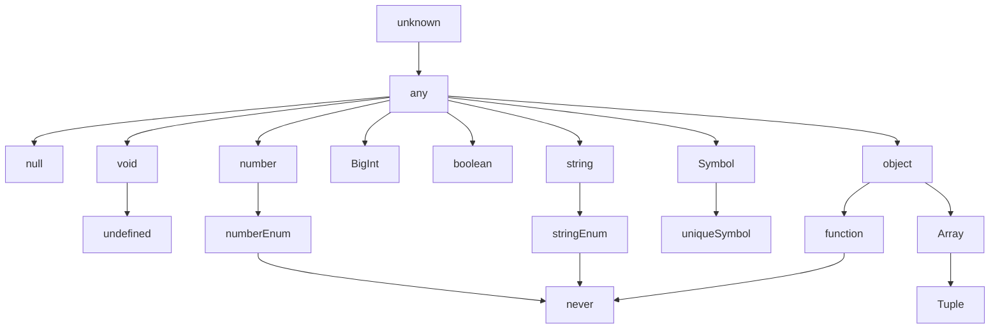

## TypeScript = JavaScript + Type Check

- TypeScript는 **AltJS**(Alternative JavaScript) 중 하나입니다.
    - AltJS는 'JavaScript 파생 언어'로, TypeScript 말고도 CoffeScript, Dart 등이 있습니다.

- TypeScript는 **JavaScript(ES5)의 Superset**(상위 확장)이므로 기존의 JavaScript 문법을 그대로 사용할 수 있습니다.
    - 따라서 TypeScript 실행 환경에 JavaScript를 coding하면 정상적으로 동작합니다.
    - 하지만 JavaScript 실행 환경에 TypeScript를 coding하면 동작하지 않습니다.

- TypeScript는 '정적 Typing', ES6(ECMAScript 2015)의 'class'와 'module', ES7의 'Decorator' 등을 지원합니다.


### TypeScript의 Type 계층 구조




---


## TypeScript의 주요 특징 : 정적 Typing

- **TypeScript는 정적(Static) Typing을 지원**합니다.
    - 정적 type 언어는 변수를 선언할 때, 변수에 할당할 값의 type에 따라 **사전에 type을 명시적으로 선언**(type declaration)하고, **선언한 type에 맞는 값을 할당**합니다.
        - type이 결정된 후에는 type을 변경할 수 없습니다.
            - 잘못된 type의 값이 할당되거나 반환되면, compiler는 이를 감지해 오류를 발생시킵니다.
        - C-family(C, Java 등) 언어도 정적 typeing을 지원하는 언어입니다.

- **JavaScript는 동적(Dynamic) Typing만을 지원**합니다.
    - JavaScript는 동적 type(dynamic typed) 언어 혹은 느슨한 type(loosely typed) 언어이며, **type의 사전 선언 없이, 값이 할당되는 과정에서 동적으로 type을 추론**(type inference)합니다.
        - 동적 type 언어는 type 추론에 의해 **변수의 type이 결정된 후에도 같은 변수에 여러 type의 값을 교차하여 할당**할 수 있습니다.
    - 동적 typing은 사용하기 간편하지만, code를 예측하기 힘들어 예상치 못한 오류를 만들 가능성이 높습니다.


### 동적 Typing과 정적 Typing의 비교

#### 동적 Typing : JavaScript

```javascript
// JavaScript
function sum(a, b) {
    return a + b;
}

sum(1, 2);    // 3
sum('x', 'y');    // 'xy' (의도하지 않은 함수 사용 방법)
```

- 함수의 의도는 2개의 number type 인수를 전달받아 합계를 반환하는 것입니다.
    - 하지만 JavaScript code에는 어떤 type의 인수를 전달해야 하는지, 어떤 type의 반환 값을 return해야 하는지 명확히 기술되어 있지 않습니다.
- 함수의 인자로 string type을 넣어도 JavaScript 문법상 어떠한 문제도 없으므로, JavaScript Engine은 개발자가 의도하지 않은 동작을 그대로 실행합니다.
- 이러한 상황이 발생한 이유는 변수나 반환 값의 type을 사전에 지정하지 않는 JavaScript의 동적 typing에 의한 것입니다.

#### 정적 Typing : TypeScript

```typescript
// TypeScript
function sum(a: number, b: number): number {
    return a + b;
}

sum(1, 2);    // 3
sum('x', 'y');    // error TS2345: Argument of type '"x"' is not assignable to parameter of type 'number'.
```

- TypeScript는 정적 typing을 지원하므로, compile 단계에서 오류를 포착할 수 있습니다.
- 또한 명시적인 type 지정을 통해 type에 대한 의도를 명확하게 기술할 수 있고, code의 가독성, 예측성, 안정성을 향상시킬 수 있습니다.
    - 이는 대규모 project 개발에 크게 도움이 됩니다.


---


## TypeScript의 특징 : 객체 지향 Programming 지원

- interface, generic 등과 같은 객체 지향 programming(OOP, Object-Orientied Programming) 지원은 크고 복잡한 project의 code 기반을 쉽게 구성할 수 있도록 돕습니다.
- Java, C# 등의 class 기반 객체 지향 언어에 익숙한 개발자가 JavaScript Project를 수행하는 데 진입 장벽을 낮추는 효과도 있습니다.


---


## TypeScript의 특징 : 도구의 지원을 받을 수 있음

- TypeScript를 사용하면 IDE(통합 개발 환경)를 포함한 다양한 도구의 지원을 받을 수 있습니다.
- IDE에 type 정보를 제공함으로써, 높은 수준의 IntelliSense, Code Assist, Type Check, Refactoring 등을 지원받을 수 있습니다.
    - 동적 typing은 IDE가 변수나 매개 변수, 함수 반환 값의 type을 알 수 없어, 개발 편의 기능을 지원할 수 없게 합니다.
- 도구의 지원은 대규모 project를 위한 필수 요소이기도 합니다.


---


## Reference

- <https://poiemaweb.com/>
- <https://opentutorials.org/course/5080>
