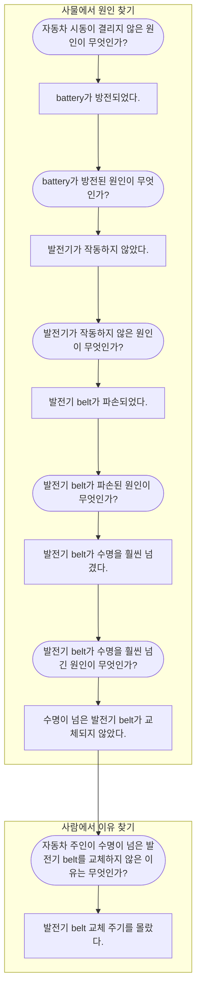
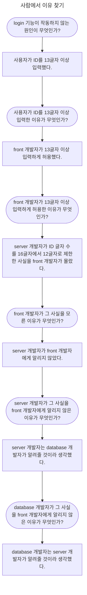

- 장애 보고서는 보통의 개발 문서와 크게 다릅니다.
- 그래서 장애 보고서는 그 특성을 충분히 이해하고 쓰지 않으면 쓸모가 없습니다.
- 장애 보고서는 **신속하게, 분석적으로, business 관점에서, 정치적으로** 작성해야 합니다.

---

## 신속한 글쓰기 : 질문에 대답하기

- 장애 보고서는 개발자가 원할 때 쓸 수 없습니다.

- 장애 보고서는 장애 발생을 인지하는 순간부터 쓸 수 있습니다.
    - 장애가 발생하기 전에 미리 쓸 수 없습니다.
    - 장애를 예상하고 써놓을 수 없습니다.

- 따라서 **신속한 글쓰기**가 필요합니다.
    - 장애 보고는 장애를 해결하면서도 해야 합니다.

- **대화를 글로 옮기는 방법**으로 글을 신속하게 쓸 수 있습니다.
    - 대화를 할 때는 일단 무슨 말이든 내뱉고 나서 생각을 정리하고, 질문을 받으면 답하면서 다음 생각으로 이어갑니다.

- 질문과 대답을 개조식으로 정리하여 사용합니다.
    - **질문은 장애 보고서의 항목**입니다.
    - **대답은 장애 보고서의 내용**입니다.

### 장애 내용에 대한 대화 (질문과 대답)

### 질문과 대답을 이용해 완성한 장애 보고서

> 제목 : **Server Module 변경 문제로 사용자 결제 불가** (10시 ~ 11시)
>
> | 항목 | 내용 |
> | --- | --- |
> | 장애 내용 | 사용자 결제 불가 (10:00 ~ 11:00, 1시간) |
> | 장애 영향 | 장애 중 결제 시도 100건 -> 1시간 후 결제 비율 10% (평균 50%) |
> | 장애 원인 | server 쪽 결제 module 변경 시 module interface의 함수를 수정했으나, front에서는 기존 함수를 호출하여 오류 발생 |
> | 조치 상황 | server 쪽의 바뀐 함수를 호출하도록 front code 수정 |
> | 조치 결과 | 결제 기능 정상 작동 |
> | 핵심 원인 | server 쪽과 front 쪽 communication 단절 |
> | 향후 대책 | server, front 팀장이 소통 방법 협의하여 보고 |

---

## 분석적 글쓰기 : 원인과 이유를 찾기

- 장애의 1차 원인은 대부분 다른 원인의 결과입니다.

- 장애의 원인을 정확히 알아내려면, **원인의 원인**을 계속 찾아 나가야 합니다.
    - 더는 원인의 원인을 찾을 수 없을 때, 그 원인이 장애의 최초 원인입니다.

- 장애의 최초 원인을 찾았다면, 그 **원인이 발생한 이유**도 알아야 합니다.
    - 장애의 재발을 막으려면 원인만 해결해서는 안 됩니다.
    - 원인이 발생한 이유를 분석해야 하며, **이유는 사람에게 있습니다.**

- 원인과 이유를 찾는 **분석적 글쓰기**가 필요합니다.
    - 분석적인 글을 쓰기 위해 5 Whys 기법을 사용할 수 있습니다.

### 5 Whys 기법으로 원인과 이유 찾기

- **5 Whys 기법**은 문제의 원인이 되는 인과 관계를 탐색할 때, **다섯 번 반복해서 원인이 무엇인지 질문하는 방식**입니다.
    - why의 뜻은 **원인**(어떤 일)과 **이유**(사람), 두 가지가 있습니다.

| why의 뜻 | 설명 |
| --- | --- |
| 원인 (cause) | 사물, 현상, 동작이 문제를 초래하는 원인입니다. |
| 이유 (reason) | 사람이 어떤 일을 하거나 하지 않은 까닭이나 동기입니다. |

- 사물에서 **원인을 찾아 문제를 해결**하고, 사람에서 **이유를 찾아 재발을 방지**합니다.

### 분석적 글쓰기 예시 1 : 자동차 시동이 걸리지 않는 원인과 이유

1. 사물에서 원인을 찾습니다.
    - 계속해서 질문함으로써 발전기 belt만 교체해서 문제를 더 효율적으로 해결할 수 있습니다.
    - 근본 원인을 찾지 못하고 피상적으로 발전기 작동만을 문제 삼았다면, 발전기 자체를 교체해야 했을 것입니다.

2. 사람에서 이유를 찾습니다.
    - 사고 재발을 막기 위해서는 자동차 주인이 발전기 belt를 교체하지 않은 이유를 알아야 합니다.
    - 따라서 발전기 belt를 교체하는 것뿐만 아니라, 자동차 주인에게 발전기 belt 교체 주기를 알려줘야 합니다.
        - 교체 주기가 2년이라면 2년이 되기 전에 자동차 주인에게 발전기 belt를 교체하라고 알려줘야 합니다.

### 분석적 글쓰기 예시 2 : Homepage Login 작동 장애의 원인과 이유

- 마지막 원인을 몰라도 개발자는 homepage login 작동 장애를 해결할 수 있습니다.
    - web page에서 ID를 12글자까지만 입력하게 하거나, database의 ID 기본 설정의 글자 수와 server program의 ID 글자 수를 12글자 이상으로 변경하면 됩니다.

- 하지만 사람의 실수는 반복되기 때문에, database 관리자가 바뀌면 똑같은 문제가 생길 가능성이 있습니다.
- 재발을 원천적으로 막으려면 원인 대신 이유를 물어봐야 합니다.
    - 이유를 물어볼 때는 항상 사람이 주어가 되어야 합니다.

- 개발자 사이의 communication 오류가 **핵심 원인**입니다.
    - 이 문제의 재발을 막으려면 database 개발자, server 개발자, front 개발자의 communication 문제를 해결해야 합니다.
    - 변경이 있을 때 내용을 공유하는 주간 변경 회의를 열거나 변경 관련 email을 보낼 때 모두 참조하게 하는 것이 방법이 될 수 있습니다.

- 핵심 원인을 찾아 재발을 방지하려면 **사람에서 이유를 찾는** 과정이 필요합니다.

---

## Business 관점의 글쓰기 : 상사를 고려하기

- 장애 보고를 받는 윗사람은 대부분 개발자가 아닙니다.
    - 윗사람 입장에서는 모든 활동은 매출과 비용으로 연결되고 측정됩니다.
        - 일이 매출이나 비용으로 측정될 수 없다면, 그 일을 해서는 안 됩니다.
    - 개발자가 장애를 해결하는 일도 매출을 늘리거나 비용을 줄이기 위함입니다.
        - "장애를 손실로 환산할 수 없다면 장애를 일으킨 service가 왜 필요한지 증명하라."라는 말이 있습니다.

- 임원 같은 윗사람은 장애를 곧 business에 주는 영향으로 봅니다.
    - 장애가 발생했다는 보고를 받으면, "그래서 손해가 얼마인가요?"라고 질문할 수 있습니다.

- 보고를 받는 사람과 소통하기 위한 **business 관점의 글쓰기**가 필요합니다.
    - 장애 보고서를 business 관점으로 쓴다는 것은 **매출과 비용 관점으로 설명**하는 것입니다.
    - **장애로 인한 손실을 계산**하는 것이 곧 business 관점으로 장애를 보고하는 방법입니다.

| 개발자 관점 | Business 관점 |
| --- | --- |
| 결제 기능이 작동하지 않음 | 기대 매출의 손실이 발생함 |
| "장애로 인해 사용자가 1시간 동안 결제하지 못함" | "장애로 인해 17억원의 매출 손실이 발생함" |

### 직접적인 손실 계산하기 : 결제 장애

1. 장애 발생 시간대의 기대 매출을 계산합니다.
    - 최근 1개월, 같은 요일 같은 시간대 매출 평균값을 기대 매출로 볼 수 있습니다.
    - 장애 시간에 특정한 event를 계획했다면, 계획한 매출 목표를 기대 매출로 잡을 수도 있습니다.

2. 장애 때 실제 발생한 매출을 계산합니다.
    - 결제 module이 완전히 마비되었다면, 실제 매출을 0일 것입니다.

3. 매출 손실을 계산합니다.
    - 매출 손실은 기대 매출에서 실제 매출을 뺀 값입니다.

4. 지연 매출을 확인합니다.
    - 장애 직후 특정 시간까지 매출이 과거 평균보다 월등히 높아진다면, 이때 늘어난 매출은 장애로 인해 지연된 매출입니다.
        - 사용자가 결제 장애 때 장바구니에 담은 상품을 장애가 해결된 뒤에 결제할 수도 있습니다.
    - 지연 매출을 매출 손실로 볼지 말지는 논의가 필요하지만, 개발자 입장에서는 지연 매출도 결국은 매출임을 주장해야 합니다.

5. 지연 매출도 매출로 인정한다면, 매출 손실을 다시 계산합니다.
    - 매출 손실은 기대 매출에서 실제 매출과 지연 매출을 뺀 값이 됩니다.

### 간접적인 손실 계산하기 : Homepage 접속 장애

- 직접적으로 관련이 없어도, 매출에 간접적인 영향을 줄 수 있습니다.

1. 비용 손실을 계산합니다.
    - 만약 homepage가 광고 매체라면, homepage 접속 장애는 광고 비용 손실로 이어집니다.
    - 또한 다른 portal site banner에 광고비를 주고 hompage를 연결한 경우, portal site에 지급하는 광고 비용도 손실로 잡힙니다.

2. 기대 매출 손실을 계산합니다.
    - 광고 비용이 아닌 매출도 손실로 잡힐 수 있습니다.
        - homepage에 접속한 사람이 회사 homepage에서 제품을 구매하지는 못하지만, 회사의 brand에 신뢰를 갖거나 제품에 대해 문의할 수도 있습니다.
    - 회사 homepage에 접속하는 100명 중 5명이 제품 구매를 문의하고, 그중 1명이 offline 매장에서 100만 원짜리 제품을 구매한다고 가정한다면, 잠재 고객 100명 중 1명은 100만원의 매출을 일으킨다고 볼 수 있으므로, 기대 매출 손실은 100만 원 입니다.

- 비용 손실과 기대 매출 손실을 합하면 homepage 접속 장애의 총 손실이 됩니다.

> network 장애로 24시간 동안 hompage 접속이 안 됐음   
> homepage 접속 장애로 netizon 100명가량이 접속할 수 없었음   
> homepage 접속 장애로 100명의 고객이 접속하지 못해 기대 매출 손실 100만 원, 비용 손실 10만 원으로 총 110만 원의 손실이 발생함

---

## 정치적 글쓰기 : 원하는 것을 얻어내기

- 개발자가 장애를 보고할 때는 **정치적 글쓰기**가 필요합니다.

- 정치적 글쓰기는 **정확한 단어와 문장으로 현상과 사실을 있는 그대로 표현하는 것**입니다.
    - 자신의 처지를 따지거나 상사 눈치를 살펴 가면서 얼버무리듯 보고하는 것이 아닙니다.
    - 장애가 발생할 확률이 10%도 안 되는데 90%인 양 호들갑을 떨거나, 장애 발생 확률이 99%나 되는데도 별일 아니라고 보고하면 안 됩니다.

### 확정적으로 말하기

- 장애는 보통 예상하지 못한 곳에서 발생합니다.
    - 그래서 장애 조치를 했다고 해서, 재발하지 않는다고 확정할 수 없습니다.

- 그러나 윗사람은 확정적인 대답을 원합니다.
    - 의사 결정을 내리려면 정확한 정보가 있어야 하기 때문입니다.

- 윗사람에게 보고할 때는 확정적이고 신뢰할 만한 결단을 정치적으로 내려야 할 필요가 있습니다.
    - 예를 들어, 재발할지도 모른다면, 그냥 재발 가능성을 20%라고 말하면 됩니다.

#### '%'로 표현한 재발 가능성

| 장애 재발 가능성 | 표현 |
| --- | --- |
| 1% | 절대 재발하지 않는다. |
| 10% | 재발하지 않는다. |
| 20% | 재발할지도 모르다. |
| 30% | 재발할 수도 있다. |
| 40% | 재발한다고 볼 수도 있다. |
| 50% | 재발할 수 있다. |
| 60% | 재발하지 않는다고 볼 수 없다. |
| 70% | 재발한다고 보여진다. |
| 80% | 재발한다. |
| 90% | 재발할 것이 틀림없다. |
| 99% | 반드시 재발한다. |

### 필요에 따라 과격하게 표현하기

- system 장애를 개발자 개인 작업으로 해결할 수 없을 때는, 예산을 들여서 system을 확장하거나 solution을 구매해서 해결해야 합니다.
- 이때 윗사람이 예산을 마련해야 한다는 것을 이해하려면, 좀 더 와닿는 표현을 사용해야 합니다.

#### 과격하게 표현하기 예시 : Data Center 냉방기 노후화

- data center의 냉방기가 노후화되어 작은 불꽃에도 화재가 발생할 수 있는 상황입니다.
    - 냉방기를 반드시 교체해야하는 상황입니다.

- "냉방기 미교체 시 화재 발생 염려"라고 보고하면, 윗사람은 냉방기를 교체해야겠다는 생각을 하지 못합니다.
- 따라서, 예산을 마련하여 냉방기를 교체하기 위해서 더 과격한 표현을 사용합니다.

> 냉방기 폭발 시 service 전면 중단   
> 냉방기 폭발 시 대표 이사 구속 100%

---

## Reference

- 개발자의 글쓰기 (도서) - 김철수
