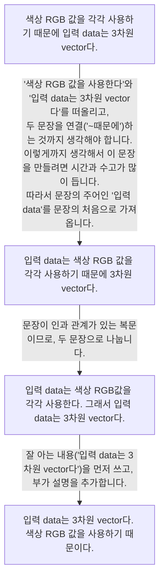

## 문장(Sentence) 구조화하기

- **핵심을 먼저 말하고 뒤에 부가 설명**을 하는 간단한 문장 구조로, 읽기 편한 문장을 쉽게 쓸 수 있습니다.
    - 문장을 만드는 방법은 다양합니다.
    - 문장을 어떻게 만드느냐에 따라 글을 쓰는 속도가 달라집니다.

```mermaid
flowchart TD

first[색상 RGB 값을 각각 사용하기 때문에 입력 data는 3차원 vector다.]
second[입력 data는 색상 RGB 값을 각각 사용하기 때문에 3차원 vector다.]
third[입력 data는 색상 RGB값을 각각 사용한다. 그래서 입력 data는 3차원 vector다.]
fourth[입력 data는 3차원 vector다. 색상 RGB 값을 사용하기 때문이다.]

first -- "'색상 RGB 값을 사용한다'와 '입력 data는 3차원 vector다'를 떠올리고,<br>두 문장을 연결('~때문에')하는 것까지 생각해야 합니다.<br>이렇게까지 생각해서 이 문장을 만들려면 시간과 수고가 많이 듭니다.<br>따라서 문장의 주어인 '입력 data'를 문장의 처음으로 가져옵니다." --> second
second -- "문장이 인과 관계가 있는 복문이므로, 두 문장으로 나눕니다." --> third
third -- "잘 아는 내용('입력 data는 3차원 vector다')을 먼저 쓰고, 부가 설명을 추가합니다." --> fourth
```

