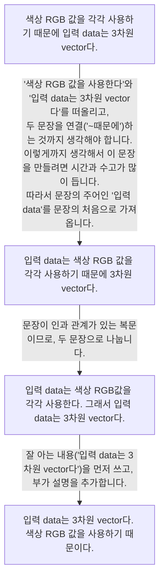

- 잘 구조화된 글은 정확성, 간결성, 가독성이 높습니다.

## 문장(Sentence) 구조화하기

- **핵심을 먼저 말하고 뒤에 부가 설명**을 하는 간단한 문장 구조로, 읽기 편한 문장을 쉽게 쓸 수 있습니다.
    - 문장을 만드는 방법은 다양합니다.
    - 문장을 어떻게 만드느냐에 따라 글을 쓰는 속도가 달라집니다.

---

## 단락(Paragraph) 구조화하기

- business 문서에는 **문단과 문단 사이에 위계**가 있어야 합니다.
    - **위계는 위치와 계층**을 합친 말입니다.

### 위치 맞추기

- **위치는 2차원 평면의 좌표**를 의미합니다.
    - 문서에서 급이 높은 문장과 급이 낮은 문장의 위치는 구별됩니다.
    - **급이 낮은 문장을 더 들여쓰기**하여 위치를 맞춥니다.

#### 위치를 맞춘 글의 예시

> ABC Service Upgrade 결과
> - 이번 대규모 upgrade 특징은 3가지입니다.
>     - 완전히 새로운 기능이 추가되었습니다.
>     - bug 없는 안정성을 확보했습니다.
>     - 인공지능으로 call center를 대체했습니다.
> - upgrade 과정은 3단계로 ...
>     - 1단계는 ...

### 계층 맞추기

- **계층은 3차원 입체의 높이**를 의미합니다.
    - 높은 곳의 요소는 낮은 곳의 요소보다 강조됩니다.
    - 문서에서 계층은 **굵기, 모양, 밑줄, 줄 간 거리** 등으로 표현합니다.

- business 문서에는 위치 뿐만 아니라 계층도 반드시 표현해야 합니다.
    - 개발자는 일반 문서를 쓸 때, code 구조처럼 위치는 과도하게 맞추지만, 계층은 거의 표현하지 않는 경향이 있습니다.
    - 계층을 표현하면 문서의 체계를 먼저 이해할 수 있으므로, 이해하기 더 쉽고 오해가 적어집니다.

#### 계층을 맞춘 글의 예시

> <strong><u>ABC Service Upgrade 결과</u></strong>
> - **이번 대규모 upgrade 특징은 3가지입니다.**
>     - 완전히 새로운 기능이 추가되었습니다.
>     - bug 없는 안정성을 확보했습니다.
>     - 인공지능으로 call center를 대체했습니다.
> - **upgrade 과정은 3단계로 ...**
>     - 1단계는 ...

---

## 서술식, 개조식, 도식을 알맞게 사용하기

| 종류 | 설명 | 사용 예시 |
| --- | --- | --- |
| 서술식 | '~다'로 끝나는 **완전한 문장으로 구성**된 글을 의미합니다. 무엇을 설명하거나 논증할 때 사용하는 방식입니다. | 개발 guide 문서 |
| 개조식 | 문장을 **명사(예를 들어, 완료, 증대)나 용언의 명사형(예를 들어, ~했음)으로 끝내는 것**을 의미합니다. 어떤 사항을 나열할 때 사용합니다. | release 문서, 장애 보고서 |
| 도식 | 사물의 구조나 관계, 상태를 **그림이나 서식으로 보여주는 것**입니다. | 표(table), 도표(graph, chart) |

- **내용과 형식이 일치**해야 합니다.
    - 줄거리가 있는 설명이나 이야기라면, 서술식으로 써야 합니다.
    - 여러 가지 종류의 항목과 내용이 반복되거나, 서술식에서 강조가 필요한 내용이라면, 개조식으로 써야 합니다.
    - 각 항목이나 사항의 관계를 명확히 규정하고 싶다면, 도식으로 써야 합니다.

### 서술식 예시

> ABC messenger에는 4가지 push 알림이 있습니다. 공지 알림은 service 변경이나 장애, event 등 messenger 운영사가 직접 보냅니다. 오전 9시부터 오후 6시 사이에만 발송합니다. message 알림은 등록된 친구가 message를 보냈을 때 자동으로 system이 전송합니다. 친구 등록 알림은 새로운 친구가 등록되었을 때 알려줍니다. 친구 해제 알림은 친구가 탈퇴했을 때 알려줍니다.

### 개조식 예시

> - **공지 알림** : service 변경이나 장애, event.
>     - messenger 운영사가 오전 9시부터 오후 6시 사이에 직접 발송.
> - **message 알림** : 등록된 친구가 message를 보냈을 때 system이 자동으로 전송.
> - **친구 등록 알림** : 새로운 친구가 등록되었을 때.
> - **친구 해제 알림** : 친구가 탈퇴했을 때.

### 도식 예시

> | 알림 종류 | 상황 | 발송 방식 | 발송 시간 |
> | --- | --- | --- | --- |
> | 공지 | service 변경, 장애, event | 수동(운영사) | 9~18시 |
> | message | 등록된 친구 message 발송 | 자동(system) | 제한 없음 |
> | 친구 등록 | 새로운 친구 등록 | 자동(system) | 제한 없음 |
> | 친구 해제 | 친구 탈퇴 | 자동(system) | 제한 없음 |

---

## Reference

- 개발자의 글쓰기 (도서) - 김철수
