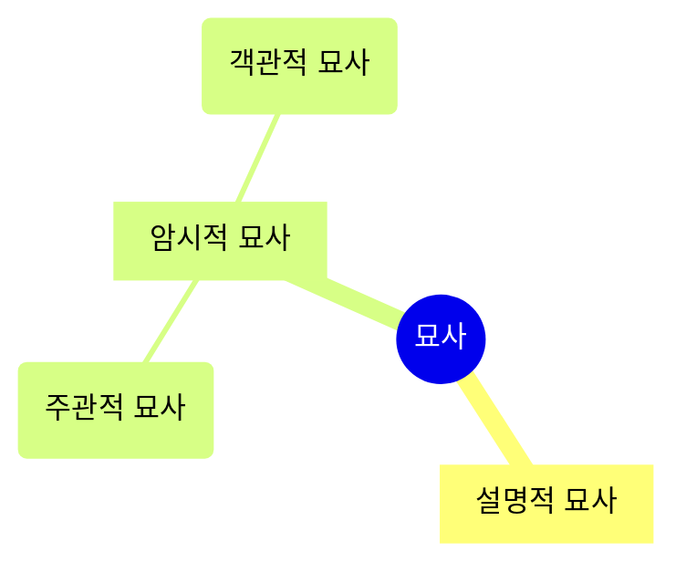

## 시에서 묘사가 중요한 이유

- 시가 힘을 가지게 되는 근원은 **추상적인 상상이 아닌 구체적으로 그려진 본질**에 있다고 할 수 있습니다.
    - 그리고 **구체적으로 그려진 본질은 묘사에 의해 획득**됩니다.
    - 따라서 시작(詩作)에서 묘사를 아는 것은 중요합니다.
    - 시에 자주 나타나는 비시적 표현의 근간은 묘사에 관한 인식 부족에 있습니다.

- 시란 **사물이나 현상에 대한 느낌(feeling)을 직접 제시하는 언술 양식**이고, 소설이란 느낌을 story로 제시하는 양식입니다.
    - 느낌을 직접 제시하는 시는 필연적으로 **지배적인 인상을 표현하는 데 적절한 묘사**를 적극 수용하게 되고, story를 제시하는 소설은 인물과 행위와 시간적 과정을 구성적으로 제시하는 서사와 만납니다.
    - 그렇기 때문에 **시는 image**(지배적 인상의 구체적 모습)라고 하기도 하고, 소설은 서사적 허구(narrative fiction)라고 부르기도 합니다.

- 묘사를 시에서 차용하면, 시의 장르적 특성인 심상적 특질을 드러내는 **시적 묘사**(poetical description)가 됩니다.
    - 설명이라는 언술 형식이 묘사를 차용하면 설명적 묘사(expositional description)가 되고, 서사가 차용하면 서사적 묘사(narrative description)가 되어, 설명이나 서사적 언술 형식의 특성에 종속되는 것과 같습니다.

---

## 묘사에서의 지배적 인상

- 시에서 지배적 인상(dominant impression)이란 **시인이 독자에게 전달하려는 주요 효과나 중심 주제를 의미**합니다.

- 지배적 인상은 **세부적인 사항들을 통일성과 전체감이 드러나도록 구성했을 때 얻어지는 종합적 효과**입니다.
    - 묘사문은 대상을 사진처럼 그대로 복사해 내는 것이 아니라, 각각의 부분들이 어우러져서 만들어 내는 독특한 인상이나 특징을 그려내는 것입니다.
    - 즉, **대상의 지배적인 인상을 중심으로 해서 세부적인 사항들의 내적 관계를 일관성 있게 드러내야 하는 것**입니다.
    - 이를 위해서는 중요한 것과 중요하지 않는 것, 세밀하게 강조해서 묘사해야 할 것과 생략될 수 있는 것들의 선택, 판단이 전제되어야 합니다.

### 지배적 인상 예시 : 이무영, "젊은 사람들" 中

> 몸도 좋았다. 동양 사람의 키로는 크면 컸지 작은 키는 아니다. 떡 벌어진 가슴은 그대로 칠판을 연상시킨다. 왕방울처럼 부리부리한 시꺼먼 눈장자에 한 줌은 되게 숱이 많은 꺼칠한 겉눈썹, 얼마간 곱곱한 기운이 있는 머리, 모가 지면서 약간 치켜 붙은 어깨, 이렇게 뜯어 보면 어디 한 군데 수월해 보이는 구석이 없건만, 진숙이 말마따나 희랍 여성 코처럼 단정해 보이는 코와 탁 트인 이마가 너그러운 인상을 주고 있다.

- 예문에서는 키, 가슴, 눈썹, 머리, 어깨, 코, 이마 등의 세부가 열거하여 인물을 묘사하고 있습니다.
- '몸이 매우 좋다'는 지배적 인상을 중심으로 세부가 묘사되어 있습니다.

---

## 묘사의 구분

- 묘사는 크게 **설명적 묘사**와 **암시적 묘사**로 나뉘며, 암시적 묘사는 다시 **주관적 묘사**와 **객관적 묘사**로 나뉩니다.

### 설명적 묘사와 암시적 묘사

- 묘사는 **동기와 목적**에 따라서 설명적 묘사와 암시적 묘사로 나뉩니다.
    - 똑같은 문장이라도 정보 전달이 목적이라면 설명적 묘사, 인상 전달이 목적이라면 암시적 묘사로 다르게 분류합니다.

| 설명적 묘사 | 암시적 묘사 |
| --- | --- |
| Expositional Description | Suggestive Description |
| 일정한 대상에 대한 정보를 전달하는 데만 목적을 둔 묘사 | 대상에 대한 지배적인 인상의 묘사를 통하여 뒤에 숨겨진 삶이나 정황을 암시하는 묘사 |
| 정보의 전달이 목적 | 인상의 전달이 목적 |

- 시가 주로 사용하는 것은 암시적 묘사입니다.

### 객관적 묘사와 주관적 묘사

- 암시적 묘사는 **작가의 심리가 투영되고 있는가 아닌가**에 따라 객관적 묘사와 주관적 묘사로 나뉩니다.
    - 객관적/주관적 묘사는 설명적/암시적 묘사처럼 엄격히 구분되지는 않습니다.

| 객관적 묘사 | 주관적 묘사 |
| --- | --- |
| Objective Description | Subjective Description |
| 시인이 선택한 한 국면을 통해 현장성 혹은 사실성(reality)으로 말하고자 하는 점을 제시하는 형식 | 심리적, 혹은 감각적 대상 파악을 위주로 하는 형식 |
| 필자의 심리가 투영되지 않음 | 필자의 감정적, 심리적 반응이 들어감 |

- 모든 작품이 전적으로 객관적이거나 주관적인 형태를 띄는 것은 아니며, **두 가지 묘사 형태가 섞여** 복합적인 형태를 띄는 것이 보통입니다.
    - 특별히 의도된 방법론이나 미적 효과를 예외로 한다면, 어느 한쪽만을 선택할 이유가 없기 때문입니다.
        - 객관적 묘사가 주관적 묘사를, 주관적 묘사가 객관적 묘사를 도와주기도 합니다.
    - 객관적 묘사든 주관적 묘사든 그 묘사의 정신은 감정과 설명을 배제하고 대상의 지배적 인상을 구체적으로 표현하는 데에 있습니다.
    - 따라서 묘사는 적절한 곳에 적절하게 사용하는 것이 중요합니다.
        - 작가가 현장과 사실을 그 바탕으로 하여 표현한다고 할 때는 객관적 묘사가 적극적으로 요구됩니다.
        - 심리적 또는 감각적 대상 파악이 그 기조를 이룰 때는 주관적 묘사의 중요성이 강조됩니다.

#### 객관적 묘사의 예시 : 김종삼, 「墨畵」

> 물먹는 소 목덜미에   
> 할머니 손이 얹혀졌다.   
> 이 하루도   
> 함께 지났다고,   
> 서로 발잔등이 부었다고,   
> 서로 적막하다고,

#### 주관적 묘사의 예시 : 김춘수, 「處暑 지나고」

> 處暑 지나고   
> 저녁에 가랑비가 내린다.   
> 泰山木 커다란 나뭇잎이 젖는다.   
> 멀리 갔다가 혼자서 돌아오는   
> 메아리처럼   
> 한 번 멎었다가 가랑비는   
> 한밤에 또 내린다.   
> 泰山木 커다란 나뭇잎이   
> 새로 한 번 젖는다.   
> 새벽녘에는 할 수 없이   
> 귀뚜라미 무릎도 젖는다.

---

## Reference

- 현대시작법 (도서) - 오규원
- <https://blog.naver.com/PostView.naver?blogId=sbk2508&logNo=222851931369&categoryNo=39&parentCategoryNo=0&viewDate=&currentPage=1&postListTopCurrentPage=1&from=postView>
- <https://m.cafe.daum.net/writinglife/IyZa/111>
