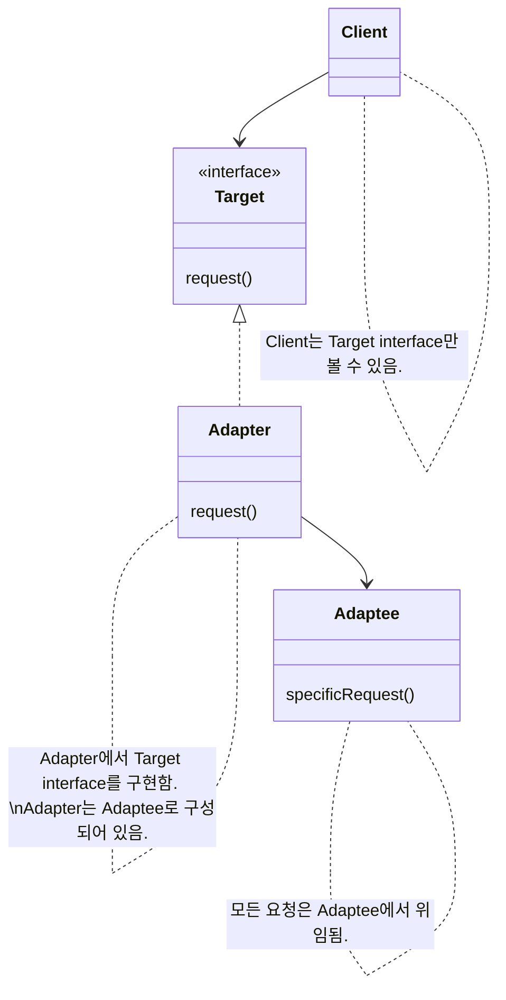
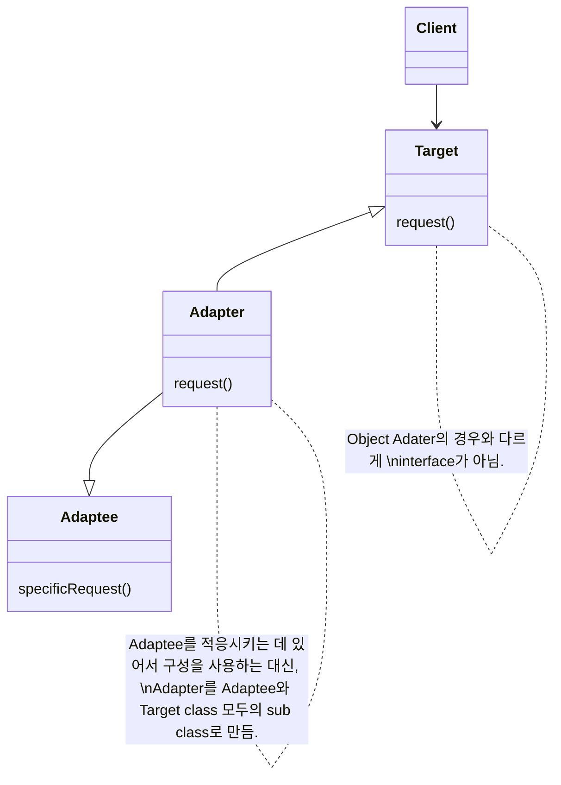

# Adapter Pattern

```
한 class의 interface를 client에서 사용하고자 하는 다른 interface로 변환합니다. Adapter를 이용하면 interface 호환성 문제 때문에 같이 쓸 수 없는 class들을 연결해서 쓸 수 있습니다.
```


- Adaptee : Adapter를 가운데 두고, Client와 정반대 위치에 있는 것

- interface를 변환해주는 Adapter를 만들어, 호환되지 않는 interface를 사용하는 Client를 그대로 활용할 수 있음
    - Client와 구현된 interface를 분리시킬 수 있음
        - Client를 특정 구현이 아닌 interface에 연결 시키기 때문
        - Target interface만 제대로 지킨다면, 나중에 다른 구현을 추가하는 것도 가능함
    - 나중에 interface가 바뀌더라도 변경 내역은 Adapter에 캡슐화되기 때문에 Client는 바뀔 필요가 없음

- Client에서 Adapter를 사용하는 방법
    1. Client에서 Target interface를 사용하여 method를 호출함으로써 Adapter에 요청을 함
    2. Adapter에서는 Adaptee interface를 사용하여 그 요청을 Adaptee에 대한 (하나 이상의) method 호출로 변환함
        - Client와 Adaptee는 분리되어 있기 때문에 서로를 알지 못함
    3. Client에서 호출 결과를 받음
        - 중간에 Adapter가 껴 있는지는 전혀 알지 못함

- Two Way Adapter (다중 Adapter) : 여러 interface를 모두 지원하는 Adapter

- Decorator Pattern & Adapter Pattern & Facade pattern
    - 공통점
        - 객체를 감싸서 호환되지 않는 interface를 Client가 사용할 수 있게 함
    - 차이점
        - Decorator Pattern : interface는 바꾸지 않고 책임(기능)만 추가
        - Adapter Pattern : 한 interface를 다른 interface로 변환
        - Facade pattern : interface를 간단하게 바꿈


## Object Adapter & Class Adapter

### Object Adapter

- 객체 구성(composition)을 사용함
    - 장점
        - Adaptee의 어떤 sub class에 대해서도 Adapter로 쓸 수 있음
        - 유연함
    - 단점
        - Adaptee의 sub class에 새로운 행동을 추가하면, sub class reference 참고하여 구현해야 함
            - Class Adapter는 이 과정이 필요 없음



### Class Adapter

- 다중 상속을 사용함
    - 장점
        - Adaptee 전체를 다시 구현하지 않아도 됨
        - sub class기 때문에 Adaptee의 행동을 override할 수 있음
            - 변경할 때 많은 곳을 수정하지 않아도 됨
    - 단점
        - 특정 Adaptee class에만 적용됨
        - 다중 상속을 지원하지 않는 언어(ex. java)에서는 사용할 수 없음




---


# Example : 


## Class Diagram


```mermaid
classDiagram

```


## Code


```java
```


---


# Reference

- Head First Design Patterns