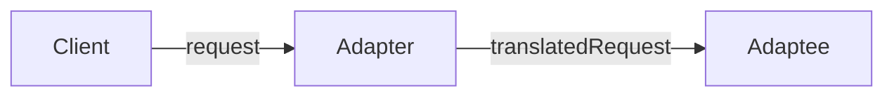

# Adapter Pattern

```
한 class의 interface를 client에서 사용하고자 하는 다른 interface로 변환합니다. Adapter를 이용하면 interface 호환성 문제 때문에 같이 쓸 수 없는 class들을 연결해서 쓸 수 있습니다.
```



- Adaptee : Adapter를 가운데 두고, Client와 정반대 위치에 있는 것

- interface를 변환해주는 Adapter를 만들어, 호환되지 않는 interface를 사용하는 Client를 그대로 활용할 수 있음
    - Client와 구현된 interface를 분리시킬 수 있음
        - Client를 특정 구현이 아닌 interface에 연결 시키기 때문
        - Target interface만 제대로 지킨다면, 나중에 다른 구현을 추가하는 것도 가능함
    - 나중에 interface가 바뀌더라도 변경 내역은 Adapter에 캡슐화되기 때문에 Client는 바뀔 필요가 없음

- Client에서 Adapter를 사용하는 방법
    1. Client에서 Target interface를 사용하여 method를 호출함으로써 Adapter에 요청을 함
    2. Adapter에서는 Adaptee interface를 사용하여 그 요청을 Adaptee에 대한 (하나 이상의) method 호출로 변환함
        - Client와 Adaptee는 분리되어 있기 때문에 서로를 알지 못함
    3. Client에서 호출 결과를 받음
        - 중간에 Adapter가 껴 있는지는 전혀 알지 못함

- Two Way Adapter (다중 Adapter) : 여러 interface를 모두 지원하는 Adapter

- Target interface의 크기와 구조에 따라 coding해야 할 분량이 결정됨

- Decorator Pattern & Adapter Pattern & Facade pattern
    - 공통점
        - 객체를 감싸서 호환되지 않는 interface를 Client가 사용할 수 있게 함
    - 차이점
        - Decorator Pattern : interface는 바꾸지 않고 책임(기능)만 추가
        - Adapter Pattern : 한 interface를 다른 interface로 변환
        - Facade pattern : interface를 간단하게 바꿈


## Object Adapter & Class Adapter

### Object Adapter

- 객체 구성(composition)을 사용함
    - 장점
        - Adaptee의 어떤 sub class에 대해서도 Adapter로 쓸 수 있음
        - 유연함
    - 단점
        - Adaptee의 sub class에 새로운 행동을 추가하면, sub class reference 참고하여 구현해야 함
            - Class Adapter는 이 과정이 필요 없음


### Class Adapter

- 다중 상속을 사용함
    - 장점
        - Adaptee 전체를 다시 구현하지 않아도 됨
        - sub class기 때문에 Adaptee의 행동을 override할 수 있음
            - 변경할 때 많은 곳을 수정하지 않아도 됨
    - 단점
        - 특정 Adaptee class에만 적용됨
        - 다중 상속을 지원하지 않는 언어(ex. java)에서는 사용할 수 없음


---


# Example : 오리 Adapter로 감싼 칠면조

- 오리처럼 걷고 꽥꽥거린다면, 반드시 오리가 아니라, 오리 Adapter로 감싼 칠면조일 수도 있음
- Duck <-> Turkey 변환
- Duck <-> Dron 변환


## Code


### Client

```java
public class DuckTestDrive {
    public static void main(String[] args) {
        Duck duck = new MallardDuck();

        Turkey turkey = new WildTurkey();
        Duck turkeyAdapter = new TurkeyAdapter(turkey);

        System.out.println("The Turkey says...");
        turkey.gobble();
        turkey.fly();

        System.out.println("\nThe Duck says...");
        testDuck(duck);

        System.out.println("\nThe TurkeyAdapter says...");
        testDuck(turkeyAdapter);
        
        // Challenge
        Drone drone = new SuperDrone();
        Duck droneAdapter = new DroneAdapter(drone);
        testDuck(droneAdapter);
    }

    static void testDuck(Duck duck) {
        duck.quack();
        duck.fly();
    }
}
```

```java
public class TurkeyTestDrive {
    public static void main(String[] args) {
        MallardDuck duck = new MallardDuck();
        Turkey duckAdapter = new DuckAdapter(duck);
 
        for(int i=0;i<10;i++) {
            System.out.println("The DuckAdapter says...");
            duckAdapter.gobble();
            duckAdapter.fly();
        }
    }
}
```


### Adapter

```java
public class DuckAdapter implements Turkey {
    Duck duck;
    Random rand;
 
    public DuckAdapter(Duck duck) {
        this.duck = duck;
        rand = new Random();
    }
    
    public void gobble() {
        duck.quack();
    }
  
    public void fly() {
        if (rand.nextInt(5)  == 0) {
             duck.fly();
        }
    }
}
```

```java
public class TurkeyAdapter implements Duck {
    Turkey turkey;
 
    public TurkeyAdapter(Turkey turkey) {
        this.turkey = turkey;
    }
    
    public void quack() {
        turkey.gobble();
    }
  
    public void fly() {
        for(int i=0; i < 5; i++) {
            turkey.fly();
        }
    }
}
```

```java
public class DroneAdapter implements Duck {
    Drone drone;
 
    public DroneAdapter(Drone drone) {
        this.drone = drone;
    }
    
    public void quack() {
        drone.beep();
    }
  
    public void fly() {
        drone.spin_rotors();
        drone.take_off();
    }
}
```


### Duck

```java
public interface Duck {
    public void quack();
    public void fly();
}
```

```java
public class MallardDuck implements Duck {
    public void quack() {
        System.out.println("Quack");
    }
 
    public void fly() {
        System.out.println("I'm flying");
    }
}
```


### Turkey

```java
public interface Turkey {
    public void gobble();
    public void fly();
}
```

```java
public class WildTurkey implements Turkey {
    public void gobble() {
        System.out.println("Gobble gobble");
    }
 
    public void fly() {
        System.out.println("I'm flying a short distance");
    }
}
```


### Dron

```java
public interface Drone {
    public void beep();
    public void spin_rotors();
    public void take_off();
}
```

```java
public class SuperDrone implements Drone {
    public void beep() {
        System.out.println("Beep beep beep");
    }
    public void spin_rotors() {
        System.out.println("Rotors are spinning");
    }
    public void take_off() {
        System.out.println("Taking off");
    }
}
```


---


# Reference

- Head First Design Patterns