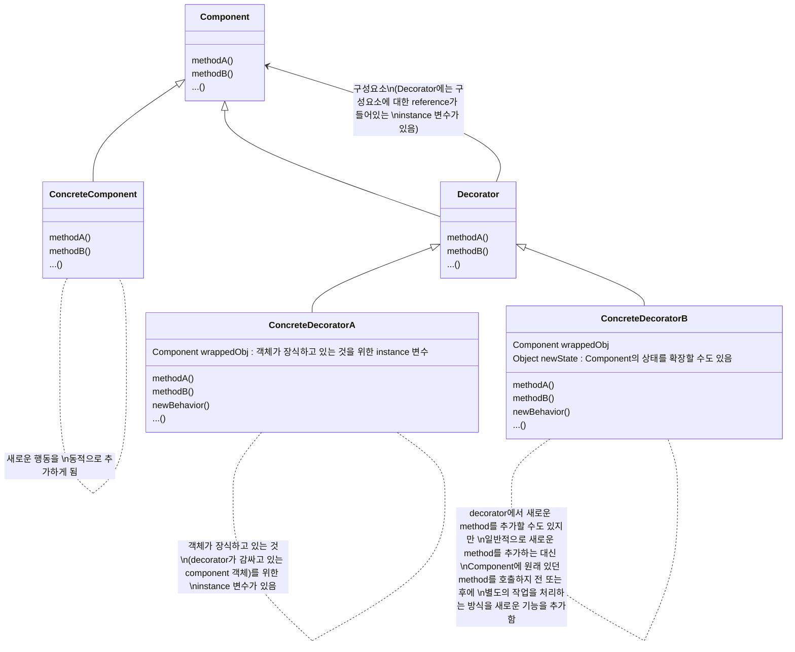
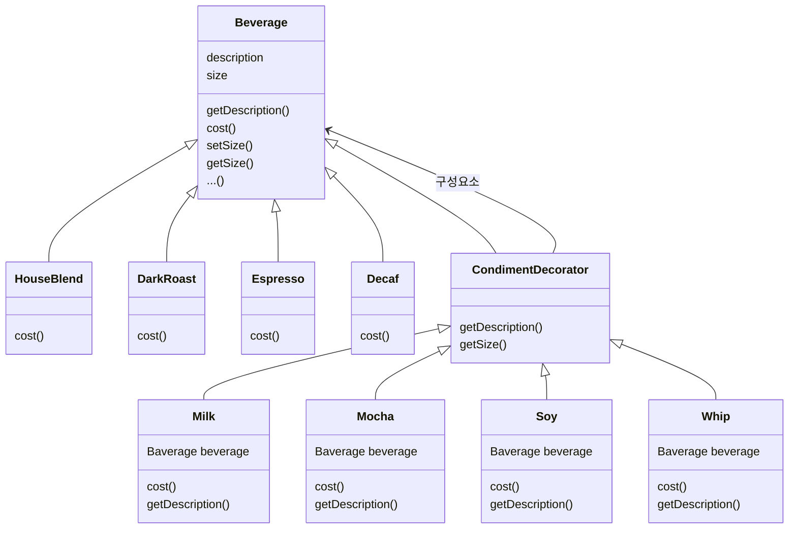

# Decorator Pattern

```
Decorator Pattern에서는 객체에 추가적인 요건을 동적으로 첨가한다. decorator는 sub class를 만드는 것을 통해서 기능을 유연하게 확장할 수 있는 방법을 제공한다.
```

- decorator는 자신이 장식하고 있는 객체에게 어떤 행동을 위임하는 것 외에, 원하는 추가적인 작업을 수행할 수 있음
- decorator의 super class는 자신이 장식하고 있는 객체의 super class와 같음
- 한 객체를 여러 개의 decorator로 감쌀 수 있음
- decorator는 자신이 감싸고 있는 객체와 같은 super class를 가지고 있기 때문에, 원래 객체(싸여져 있는 객체)가 들어간 자리에 decorator 객체를 집어넣어도 상관 없음
- 객체는 언제든지 감쌀 수 있기 때문에 실행 중에 필요한 decorator를 마음대로 적용할 수 있음

- 구성과 위임을 통한 실행 중 행동 추가
    - 구성을 통해서 객체의 행동을 확장하면 실행 중에 동적으로 행동을 설정할 수 있음
        - 행동을 상속 받으면(sub class를 만드는 방식), 그 행동은 compile 시에 완전히 결정되기 때문에 새로운 행동을 추가하기 어려움
    - 구상 구성요소를 감싸주는 decorator를 사용하여 결과에 새로운 기능을 더해 행동을 확장함
        - 구성요소를 감싸는 decorator의 갯수에는 제한이 없기 때문에 super class code를 건드리지 않고 행동을 무한히 확장하는 것이 가능함

- decorator를 너무 많이 사용하면 code가 필요 이상으로 복잡해질 수도 있음
    - option마다 만들다보면 자잘한 decorator 객체들이 많이 추가될 수 있기 때문
    - 이 문제를 factory pattern과 builder pattern이 해결해줄 수 있음

## Class Diagram




---

# Example : 음료에 첨가물(shot, syrup, milk, whip)을 동적으로 넣고 가격 계산하기

- decorator pattern에서의 상속과 구성
    - 상속을 받지만, 상속을 통해서 행동을 물려받는 것이 목적이 아님
        - decorator pattern에서 상속은 형식을 맞추기 위한 것
            - decorator의 형식이 그 decorator로 감싸는 객체의 형식과 같음
    - 새로운 행동을 객체들을 구성하는 방법을 통해서 얻게 됨
        - super class에서 행동을 상속 받으면서 얻는 것이 아님
    - 음료와 첨가물을 다양하게 섞어도 유연성을 잃지 않음
        - instance 변수로 다른 객체를 저장하는 객체 구성 방식을 이용하기 때문

## Class Diagram



## Code

### Main

```java
public class StarbuzzCoffee {
 
    public static void main(String args[]) {
        Beverage beverage = new Espresso();
        System.out.println(beverage.getDescription() + " $" + String.format("%.2f", beverage.cost()));
 
        Beverage beverage2 = new DarkRoast();
        beverage2 = new Mocha(beverage2);
        beverage2 = new Mocha(beverage2);
        beverage2 = new Whip(beverage2);
        System.out.println(beverage2.getDescription() + " $" + String.format("%.2f", beverage2.cost()));
 
        Beverage beverage3 = new HouseBlend();
        beverage3.setSize(Size.VENTI);
        beverage3 = new Soy(beverage3);
        beverage3 = new Mocha(beverage3);
        beverage3 = new Whip(beverage3);
        System.out.println(beverage3.getDescription() + " $" + String.format("%.2f", beverage3.cost()));
    }
}
```

### Component class : 음료(beverage)를 나타내는 추상 class

```java
public abstract class Beverage {
    public enum Size { TALL, GRANDE, VENTI };
    Size size = Size.TALL;
    String description = "Unknown Beverage";
  
    public String getDescription() {
        return description;
    }
    
    public void setSize(Size size) {
        this.size = size;
    }
    
    public Size getSize() {
        return this.size;
    }
 
    public abstract double cost();
}
```

### Decorator class : 첨가물(condiment)을 나타내는 추상 class

```java
public abstract class CondimentDecorator extends Beverage {
    public Beverage beverage;
    public abstract String getDescription();
    
    public Size getSize() {
        return beverage.getSize();
    }
}
```

### ConcreteComponent class : 음료 구현

```java
public class HouseBlend extends Beverage {
    public HouseBlend() {
        description = "House Blend Coffee";
    }
 
    public double cost() {
        return .89;
    }
}
```

```java
public class DarkRoast extends Beverage {
    public DarkRoast() {
        description = "Dark Roast Coffee";
    }
 
    public double cost() {
        return .99;
    }
}
```

```java
public class Espresso extends Beverage {
    public Espresso() {
        description = "Espresso";
    }
  
    public double cost() {
        return 1.99;
    }
}
```

```java
public class Decaf extends Beverage {
    public Decaf() {
        description = "Decaf Coffee";
    }
 
    public double cost() {
        return 1.05;
    }
}
```

### ConcreteDecorator class : 첨가물 구현

```java
public class Milk extends CondimentDecorator {
    public Milk(Beverage beverage) {
        this.beverage = beverage;
    }

    public String getDescription() {
        return beverage.getDescription() + ", Milk";
    }

    public double cost() {
        return beverage.cost() + .10;
    }
}
```

```java
public class Mocha extends CondimentDecorator {
    public Mocha(Beverage beverage) {
        this.beverage = beverage;
    }
 
    public String getDescription() {
        return beverage.getDescription() + ", Mocha";
    }
 
    public double cost() {
        return beverage.cost() + .20;
    }
}
```

```java
public class Soy extends CondimentDecorator {
    public Soy(Beverage beverage) {
        this.beverage = beverage;
    }

    public String getDescription() {
        return beverage.getDescription() + ", Soy";
    }

    public double cost() {
        double cost = beverage.cost();
        if (beverage.getSize() == Size.TALL) {
            cost += .10;
        } else if (beverage.getSize() == Size.GRANDE) {
            cost += .15;
        } else if (beverage.getSize() == Size.VENTI) {
            cost += .20;
        }
        return cost;
    }
}
```

```java
public class Whip extends CondimentDecorator {
    public Whip(Beverage beverage) {
        this.beverage = beverage;
    }
 
    public String getDescription() {
        return beverage.getDescription() + ", Whip";
    }
 
    public double cost() {
        return beverage.cost() + .10;
    }
}
```


---

# Reference

- Head First Design Patterns