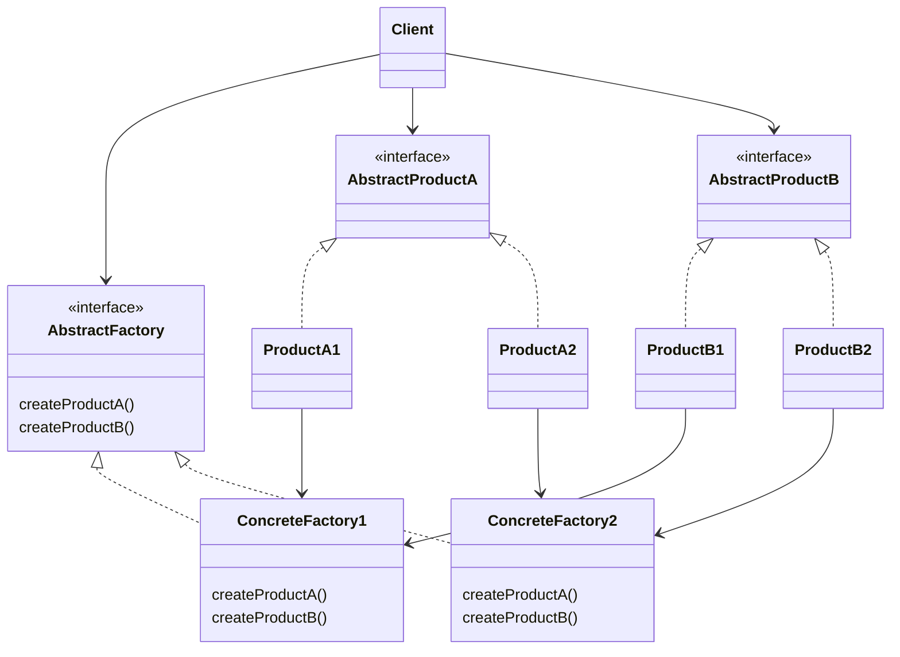
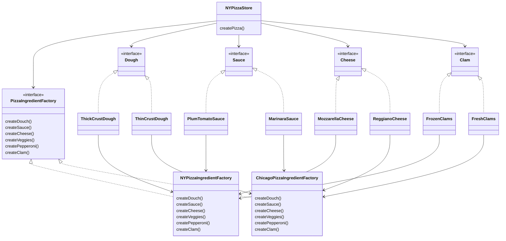

# Abstract Factory Pattern

```
추상 factory pattern에서는 interface를 이용하여 서로 연관된, 또는 의존하는 객체를 구상 class를 지정하지 않고도 생성할 수 있습니다.
```

- 구상 class에 직접 의존하지 않고, 서로 관련된 객체들로 이루어진 제품군을 만들기 위한 용도로 사용함
    - client에서 추상 interface를 통해서 일련의 제품들을 공급받을 수 있음
    - 실제로 어떤 제품이 생산되는지는 전혀 알 필요가 없음
        - client와 factory에서 생산되는 제품을 분리시킬 수 있음


## Factory Method Pattern & Abstract Factory Pattern

- 두 pattern 모두 application을 특정 구현으로부터 분리시키는 역할을 하지만, 방법이 다름
    - 객체 생성을 캡슐화해서 application의 결합을 느슨하게 만들고, 특정 구현에 덜 의존하도록함
    - 객체를 만드는 방법에서 가장 큰 차이를 보임
        - factory method pattern : 상속
        - abstract factory pattern : 구성

- factory method pattern
    - 상속을 통해서 객체를 만듬
    - sub class를 통해서 객체를 만듬
    - client와 구상 형식을 분리시켜주는 역할
        - client에서는 자신이 사용할 추상 형식만 알면 되고, 구상 형식은 sub class에서 처리해 줌
    - 'client code'와 'instance를 만들어야할 구상 class'를 분리시켜야 할 때 활용하기
        - 어떤 구상 class를 필요로 하게 될지 미리 알 수 없는 경우에도 유용함
            - sub class를 만들고 factory method를 구현하기만 하면 됨

- abstract factory pattern
    - 구성(composition)을 통해서 객체를 만듬
    - 제품군을 만들기 위한 추상 형식을 제공함
        - 제품이 생산되는 방법은 이 추상 형식의 sub class에서 정의됨
    - factory method patternㅇ르 쓸 때와 마찬가지로 client와 client에서 사용하는 실제 구상 제품이 분리됨
    - 일련의 연관된 제품을 하나로 묶을 수 있음
    - 제품군에 제품을 추가하거나 하는 식으로 관련된 제품들을 확대해야 하는 경우에는 interface를 수정해야만 함
        - interface를 바꾸게 되면 모든 sub class의 interface를 바꿔야 하므로 좋지 않음
    - 구상 factory를 구현할 때 factory method를 사용하기도 함
        - factory method pattern과는 다르게 제품을 생산하기 위한 용도로 쓰임
    - client에서 제품군(서로 연관된 일련의 제품들)을 만들어야 할 때 활용하기


## Class Diagram



---


# Example : Pizza 가게


## factory method pattern -> abstract factory pattern

- pizza 가게들이 pizza의 원재료를 다른 것을 사용하지 못하도록 강제하기 위해 재료 factory를 추가하는 상황
- 추상 factory(abstract factory)를 도입해서 서로 다른 pizza에서 필요로 하는 원재료군을 생산하기 위한 방법을 구축함
    - 제품군을 생성하기 위한 interface를 제공함
    - 이 interface를 이용하느 code를 만들면 code를 제품을 생산하는 실제 factory와 분리시킬 수 있음


## Class Diagram




---

# Reference

- Head First Design Patterns