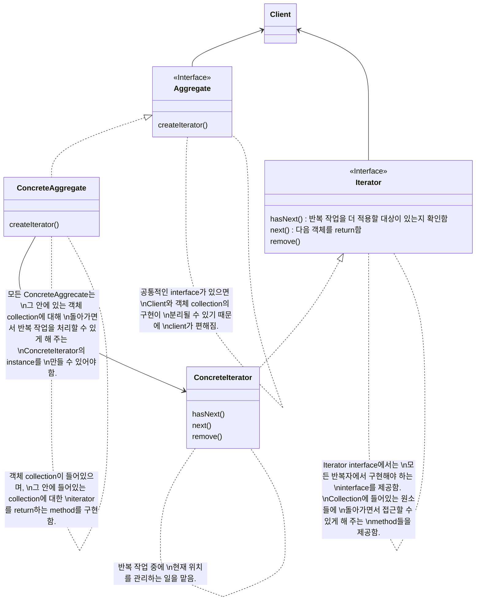
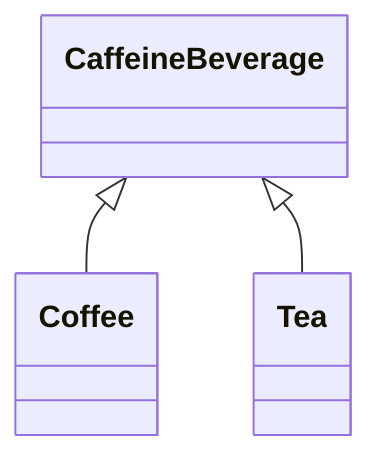

# Iterator Pattern

```
collection 구현 방법을 노출시키지 않으면서도 그 집합체 안에 들어있는 모든 항목에 접근할 수 있게 해 주는 방법을 제공해 줍니다.
```

- 내부적인 구현 방법을 외부로 노출시키지 않으면서도, 집합체에 있는 모든 항목에 일일이 접근할 수 있음
    - 각 항에 일일이 접근할 수 있게 해주는 기능을 `collection(집합체)`이 아닌 `iterator(반복자)` 객체에서 책임지게 됨
        - `반복(바뀌는 부분)`을 iterator로 캡슐화하여 collection으로 부터 일부 책임을 분리함
            - 집합체 내에서 어떤 식으로 일이 처리되는지는 모르는 상태에서 그 안의 항목들에 대해 반복 작업을 수행할 수 있음
        - 집합체 interface 및 구현이 간단해지고, 각자 중요한 일만 잘 처리할 수 있게 함
            - 집합체는 반복 작업으로부터 손을 떼고 자신의 일(객체 collection 관리)을 할 수 있게 되므로

- Iterator method : `옛날`과 `지금(java iterator 기준)`
    - method 종류
        - 옛날 : first(), next(), isDone(), currentItem() 
        - 지금 : next(), hasNext(), remove()
    - 옛날의 next()와 currentItem()은 지금의 next() 하나로 합쳐짐
    - 옛날의 isDone()은 지금의 hasNext()와 같은 기능임
    - 옛날의 first()는 지금 없음
        - java에서는 처음부터 다시 돌리고 싶은 경우에 그냥 반복자를 새로 만드는 방식을 주로 사용하기 때문
    - 지금의 remove()는 확장된 method임

- 내부(internal) 반복자 & 외부(external) 반복자
    - 외부 반복자
        - client가 반복 작업을 제어함
            - client에서 next()를 호출해서 다음 항목을 가져오기 때문
    - 내부 반복자
        - 반복자 자신에 의해서 제어됨
            - client가 반복자한테 모든 원소에 대해서 어떤 일을 할 것인지 알려줘야 함
                - 반복자가 다음 원소에 대해서 작업을 직접 처리하기 때문
        - 외부 반복자를 쓰는 경우에 비해 유연성이 떨어짐
            - client가 반복 작업을 마음대로 제어할 수 없기 때문
        - 할 일을 넘겨주기만 하면 나머지는 반복자에서 알아서 해 주기 때문에 더 편리할 때도 있음

- 반대 방향으로 움직이는 반복자
    - 이전 항목으로 가기 위한 method와 원소 collection에서 첫 번째 원소 위치에 있는지를 알려주는 method가 추가적으로 필요함

- 반복자를 이용하면 다형적인 code를 만들 수 있는 이유
    - iterator를 지원하기만 하면 어떤 collection에 대해서도 사용할 수 있는 code를 만드는 것이기 때문
        - iterator를 지원하기 위해서는 iterator를 매개변수로 받아들이는 method를 만들어야 함
    - collection의 구체적인 구현 방식에는 신경쓰지 않아도 됨
        - 어차피 iterator를 지원하면 원하는 반복 작업을 할 수 있기 때문

- Enumeration & Iterator
    | Enumeration | Iterator |
    | - | - |
    | hasMoreElements() | hasNext() |
    | nextElement() | next() |
    - 옛날에는 Iterator 용도로 Enumeration을 사용했음
    - java에서는 반복자의 용도로 대부분 Iterator를 사용함
    - Enumeration에서 Iterator로, 또는 그 반대로 변환해야 하는 경우에는 Adapter Pattern을 사용하기


## Class Diagram




---


# Example : 


## Class Diagram




## Code


---


# Reference

- Head First Design Patterns