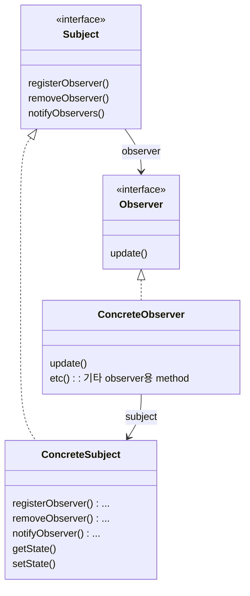
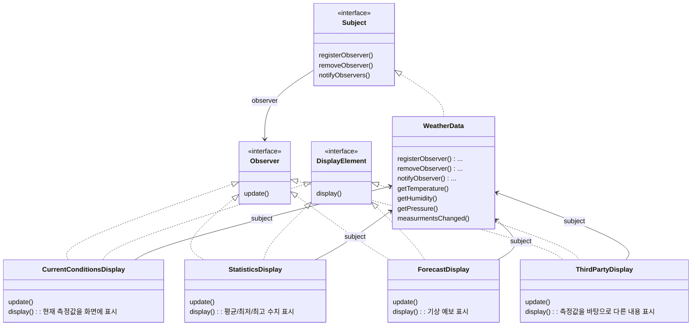

# Observer Pattern

```
Observer Pattern에서는 한 객체의 상태가 바뀌면 그 객체에 의존하는 다른 객체들한테 연락이 가고 자동으로 내용이 갱신되는 방식으로 일대다(one-to-many) 의존성을 정의합니다.
```
- 일련의 객체들 사이에서 일대다 관계를 정의함
- 한 객체의 상태가 변경되면 그 객체에 의존하는 모든 객체에 연락이 감

- 뭔가 중요한 일이 일어났을 때 객체들한테 새 소식을 알려줄 수 있는 pattern
- 객체 쪽에서는 계속해서 정보를 받을지 여부를 실행 중에 결정할 수 있음

- observer pattern에서 변하는 것은 'subject의 상태'와 'observer의 개수, 형식' 뿐임
    - 이 바뀌는 부분을 분리시켜 subject를 바꾸지 않고도 subject의 상태에 의존하는 객체들을 바꿀 수 있음
        - 바뀌는 부분과 바뀌지 않는 부분의 분리

## Subject & Observer

- Subject
    - data의 주인
    - observer pattern에서 상태를 저장하고 지배함
    - 구성(composition)을 활용하여 observer들을 관리함
        - subject와 observer 사이의 관계는 상속이 아니라 구성에 의해서 이루어짐

- Observer
    - observer가 또 다른 객체의 subject가 될 수도 있음
    - data의 주인이 subject이기 때문에 의존성을 가짐

### 예시 : 신문 구독

- 구독자(observer)가 신문 구독(observer 등록)을 하면 출판사(subject)는 구독자(observer)에게 신문(data)을 보내줌
- 구독자(observer)가 신문 구독을 해지(observer 해제)하면 출판사(subject)는 더 이상 구독자(observer)에게 신문(data)을 보내지 않음

## Class Diagram




## observer parttern의 느슨한 결합(loose coupling)

- '두 객체가 느슨하게 결합되어 있다' == '그 둘이 상호작용을 하긴 하지만 서로에 대해 잘 모른다'

- observer pattern에서는 subject와 obserer가 느슨하게 결합되어 있는 객체 design을 제공함
    1. subject가 observer에 대해서 아는 것은 observer가 특정 interface(observer interface)를 구현한다는 것 뿐임
        - observer의 구상 class가 무엇인지, observer가 무엇을 하는지 등에 대해서는 알 필요가 없음
    2. observer는 언제든지 새로 추가할 수 있음
        - subject는 observer interface를 구현하는 객체의 목록에만 의존하기 때문에 언제든지 새로운 observer를 추가할 수 있음
        - 실행 중에 한 observer를 다른 observer로 바꿔도 됨
            - 이렇게 해도 subject 객체는 계속해서 data를 보낼 수 있음
        - 또한, obsever를 아무때나 제거해도 됨
    3. 새로운 형식의 observer를 추가하려고 할 때도 subject를 전혀 변경할 필요가 없음
        - 새로운 class에서 observer interface를 구현하고 observer로 등록하기만 하면 됨
        - observer interface만 구현한다면 어떤 객체든지 연락을 하기 때문
    4. subject와 observer는 서로 독립적으로 재사용할 수 있음
        - subject와 observer를 다른 용도로 활용할 일이 있다고 해도 손쉽게 재사용할 수 있음
        - 서로 단단하게 결합되어 있지 않기 때문
    5. subject나 observer가 바뀌더라도 서로한테 영향을 미치지 않음
        - 서로 느슨하게 결합되어 있기 때문에 subject 또는 observer interface를 구현한다는 조건만 만족된다면 변경에 의한 문제는 발생하지 않음


---

# Example : 기상 monitoring application

## 이 system을 구성하는 세 요소

1. 기상 station : 실제 기상 정보를 수집하는 장비
    - sensor(온도, 습도, 압력)로부터 측정값을 수집함
2. WeatherData 객체 : 기상 station으로부터 오는 data를 추적하는 객체
    - 기상 station 장비 자체로부터 data를 가져올 수 있음
    - 모든 상태를 가지고 있음
3. Display : 사용자에게 현재 기상 조건을 보여주는 display
    - 현재 조건(온도, 습도, 압력) 화면
    - 기상 통계 화면
    - 기상 예보 화면
    - ...

## 관계

- WeatherData : Display = Subject : Observer = 1 : N
    - WeatherData class의 상태가 바뀌면 Display에 알려줘야 함

## Class Diagram



## Code

### Main

```java
public class WeatherStation {

    public static void main(String[] args) {
        WeatherData weatherData = new WeatherData();
    
        CurrentConditionsDisplay currentDisplay = 
            new CurrentConditionsDisplay(weatherData);
        StatisticsDisplay statisticsDisplay = new StatisticsDisplay(weatherData);
        ForecastDisplay forecastDisplay = new ForecastDisplay(weatherData);

        weatherData.setMeasurements(80, 65, 30.4f);
        weatherData.setMeasurements(82, 70, 29.2f);
        weatherData.setMeasurements(78, 90, 29.2f);
        
        weatherData.removeObserver(forecastDisplay);
        weatherData.setMeasurements(62, 90, 28.1f);
    }
}
```

### Interface

```java
public interface Subject {
    public void registerObserver(Observer o);
    public void removeObserver(Observer o);
    public void notifyObservers();
}
```

```java
public interface Observer {
    public void update(float temp, float humidity, float pressure);
}
```

```java
public interface DisplayElement {
    public void display();
}
```

### Subject Interface 구현

```java
public class WeatherData implements Subject {
    private List<Observer> observers;
    private float temperature;
    private float humidity;
    private float pressure;
    
    public WeatherData() {
        observers = new ArrayList<Observer>();
    }
    
    public void registerObserver(Observer o) {
        observers.add(o);
    }
    
    public void removeObserver(Observer o) {
        observers.remove(o);
    }
    
    public void notifyObservers() {
        for (Observer observer : observers) {
            observer.update(temperature, humidity, pressure);
        }
    }
    
    public void measurementsChanged() {
        notifyObservers();
    }
    
    public void setMeasurements(float temperature, float humidity, float pressure) {
        this.temperature = temperature;
        this.humidity = humidity;
        this.pressure = pressure;
        measurementsChanged();
    }

    public float getTemperature() {
        return temperature;
    }
    
    public float getHumidity() {
        return humidity;
    }
    
    public float getPressure() {
        return pressure;
    }

}
```

### Display 구현

```java
public class CurrentConditionsDisplay implements Observer, DisplayElement {
    private float temperature;
    private float humidity;
    private WeatherData weatherData;
    
    public CurrentConditionsDisplay(WeatherData weatherData) {
        this.weatherData = weatherData;
        weatherData.registerObserver(this);
    }
    
    public void update(float temperature, float humidity, float pressure) {
        this.temperature = temperature;
        this.humidity = humidity;
        display();
    }
    
    public void display() {
        System.out.println("Current conditions: " + temperature 
            + "F degrees and " + humidity + "% humidity");
    }
}
```

```java
public class StatisticsDisplay implements Observer, DisplayElement {
    private float maxTemp = 0.0f;
    private float minTemp = 200;
    private float tempSum = 0.0f;
    private int numReadings;
    private WeatherData weatherData;

    public StatisticsDisplay(WeatherData weatherData) {
        this.weatherData = weatherData;
        weatherData.registerObserver(this);
    }

    public void update(float temp, float humidity, float pressure) {
        tempSum += temp;
        numReadings++;

        if (temp > maxTemp) {
            maxTemp = temp;
        }
 
        if (temp < minTemp) {
            minTemp = temp;
        }

        display();
    }

    public void display() {
        System.out.println("Avg/Max/Min temperature = " + (tempSum / numReadings)
            + "/" + maxTemp + "/" + minTemp);
    }
}
```

```java
public class ForecastDisplay implements Observer, DisplayElement {
    private float currentPressure = 29.92f;  
    private float lastPressure;
    private WeatherData weatherData;

    public ForecastDisplay(WeatherData weatherData) {
        this.weatherData = weatherData;
        weatherData.registerObserver(this);
    }

    public void update(float temp, float humidity, float pressure) {
        lastPressure = currentPressure;
        currentPressure = pressure;

        display();
    }

    public void display() {
        System.out.print("Forecast: ");
        if (currentPressure > lastPressure) {
            System.out.println("Improving weather on the way!");
        } else if (currentPressure == lastPressure) {
            System.out.println("More of the same");
        } else if (currentPressure < lastPressure) {
            System.out.println("Watch out for cooler, rainy weather");
        }
    }
}
```

---

# Reference

- Head First Design Patterns