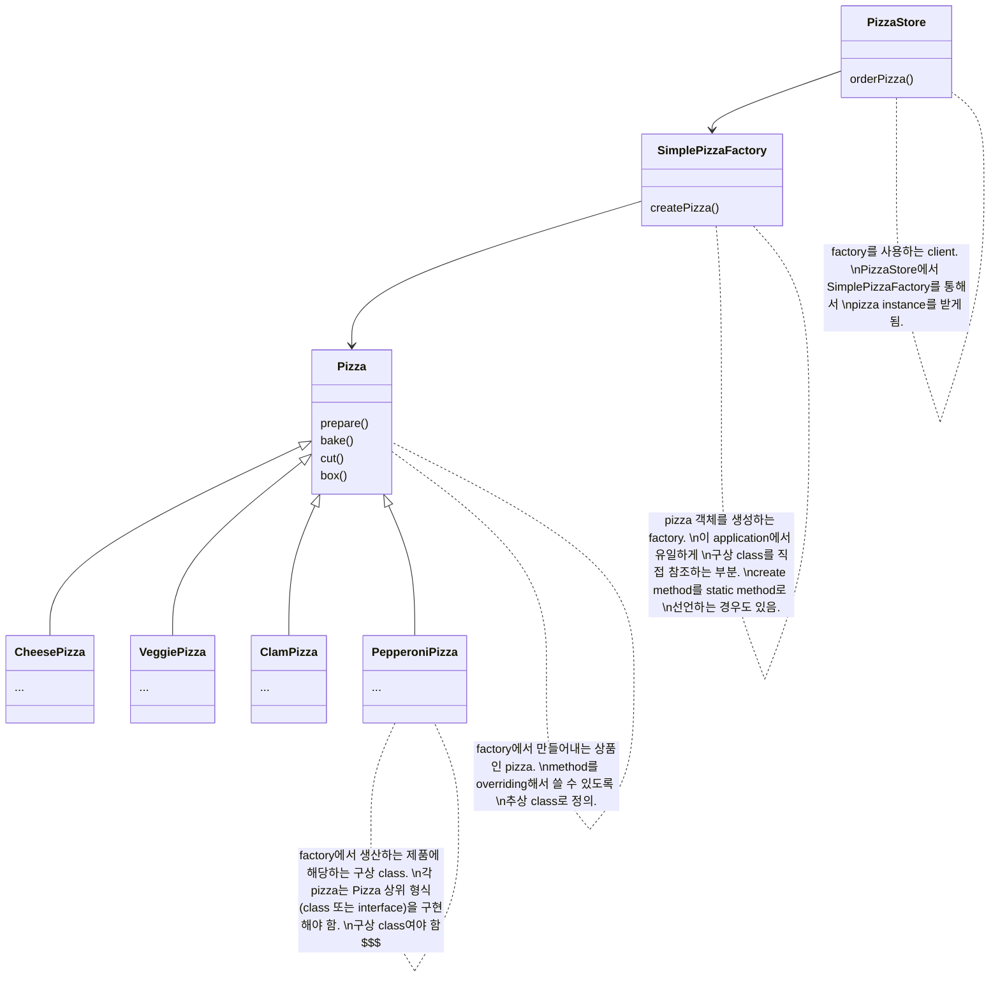

# Simple Factory

- design pattern은 아니지만 factory pattern(factory method pattern, abstract factory pattern)의 기본이 되는 개념
    - programming을 하는 데에 자주 쓰이는 관용구에 가까움

- interface에 맞춰서 coding하면 system에서 일어나는 여러 변화에 대응할 수 있음
    - new(구상 객체)를 바탕으로 coding하면 나중에 code를 수정해야 할 가능성이 높아지고 유연성이 떨어짐
        - 새로운 구상 class가 추가될 때마다 code를 고쳐야 함 == 변화에 대해 닫혀있는 code
    - interface를 바탕으로 code를 만들면, 다형성 덕분에 어떤 class든 특정 interface만 구현하면 사용할 수 있음
        - 바뀔 수 있는 부분을 찾아내서 바뀌지 않는 부분과 분리시키기 때문

- simple factory는 객체 생성 부분을 캡슐화한 것
    - 객체 생성을 처리하는 class는 factory라고 부름
    - 객체를 생성하는 작업을 한 class에 캡슐화시켜 놓으면, 구현을 변경해야 하는 경우에 여기저기 다 들어가서 고칠 필요 없이 factory class 하나만 고치면 됨

- 정적(static) factory
    - simple factory를 static method로 정의하는 기법
    - 장점 : 객체를 생성하기 위한 method를 실행시키기 위해서 객체의 instance를 만들지 않아도 됨
    - 단점 : sub class를 만들어서 객체 생성 method의 행동을 변경시킬 수 없음

---

# Example : Pizza 가게

## Class Diagram



## Code

### Main

```java
public class PizzaTestDrive {
 
    public static void main(String[] args) {
        SimplePizzaFactory factory = new SimplePizzaFactory();
        PizzaStore store = new PizzaStore(factory);

        Pizza pizza = store.orderPizza("cheese");
        System.out.println("We ordered a " + pizza.getName() + "\n");
        System.out.println(pizza);
 
        pizza = store.orderPizza("veggie");
        System.out.println("We ordered a " + pizza.getName() + "\n");
        System.out.println(pizza);
    }
}
```

### PizzaStore

```java
public class PizzaStore {
    SimplePizzaFactory factory;
 
    public PizzaStore(SimplePizzaFactory factory) { 
        this.factory = factory;
    }
 
    public Pizza orderPizza(String type) {
        Pizza pizza;
 
        pizza = factory.createPizza(type);
 
        pizza.prepare();
        pizza.bake();
        pizza.cut();
        pizza.box();

        return pizza;
    }

}
```

### SimplePizzaFactory

```java
public class SimplePizzaFactory {

    public Pizza createPizza(String type) {
        Pizza pizza = null;

        if (type.equals("cheese")) {
            pizza = new CheesePizza();
        } else if (type.equals("pepperoni")) {
            pizza = new PepperoniPizza();
        } else if (type.equals("clam")) {
            pizza = new ClamPizza();
        } else if (type.equals("veggie")) {
            pizza = new VeggiePizza();
        }
        return pizza;
    }
}
```

### Pizza

```java
abstract public class Pizza {
    String name;
    String dough;
    String sauce;
    List<String> toppings = new ArrayList<String>();

    public String getName() {
        return name;
    }

    public void prepare() {
        System.out.println("Preparing " + name);
    }

    public void bake() {
        System.out.println("Baking " + name);
    }

    public void cut() {
        System.out.println("Cutting " + name);
    }

    public void box() {
        System.out.println("Boxing " + name);
    }

    public String toString() {
        // code to display pizza name and ingredients
        StringBuffer display = new StringBuffer();
        display.append("---- " + name + " ----\n");
        display.append(dough + "\n");
        display.append(sauce + "\n");
        for (String topping : toppings) {
            display.append(topping + "\n");
        }
        return display.toString();
    }
}
```

### Pizza의 구상 class

```java
public class CheesePizza extends Pizza {
    public CheesePizza() {
        name = "Cheese Pizza";
        dough = "Regular Crust";
        sauce = "Marinara Pizza Sauce";
        toppings.add("Fresh Mozzarella");
        toppings.add("Parmesan");
    }
}
```

```java
public class VeggiePizza extends Pizza {
    public VeggiePizza() {
        name = "Veggie Pizza";
        dough = "Crust";
        sauce = "Marinara sauce";
        toppings.add("Shredded mozzarella");
        toppings.add("Grated parmesan");
        toppings.add("Diced onion");
        toppings.add("Sliced mushrooms");
        toppings.add("Sliced red pepper");
        toppings.add("Sliced black olives");
    }
}
```

```java
public class ClamPizza extends Pizza {
    public ClamPizza() {
        name = "Clam Pizza";
        dough = "Thin crust";
        sauce = "White garlic sauce";
        toppings.add("Clams");
        toppings.add("Grated parmesan cheese");
    }
}
```


```java
public class PepperoniPizza extends Pizza {
    public PepperoniPizza() {
        name = "Pepperoni Pizza";
        dough = "Crust";
        sauce = "Marinara sauce";
        toppings.add("Sliced Pepperoni");
        toppings.add("Sliced Onion");
        toppings.add("Grated parmesan cheese");
    }
}
```


---

# Reference

- Head First Design Patterns