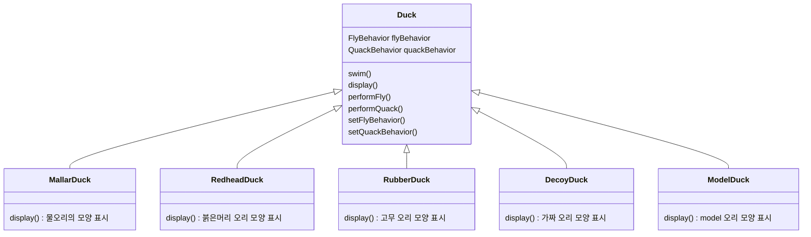
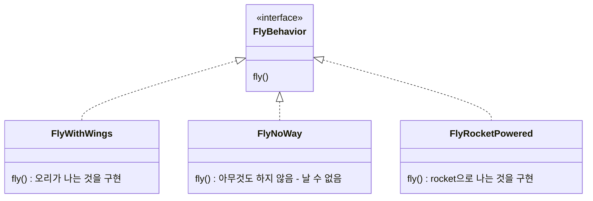
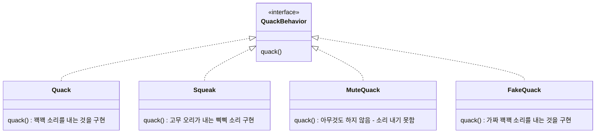

# Strategy Pattern

- 알고리즘군을 정의하고 각각을 캡슐화하여 교환해서 사용할 수 있도록 만듬
- algorithm을 사용하는 client와는 독립적으로 algorithm을 변경할 수 있음


---

# Example : 오리 Class

- client에서는 '나는 행동'과 '꽥꽥거리는 행동' 모두에 대해서 캡슐화된 알고리즘군을 '활용'함
    - client는 setter로 행동 변수를 설정하고 perform 함수를 사용하면 됨
        - ex) setFlyBehavior() -> performFly()
- 각 행동의 집합을 알고리즘군으로 생각하면 됨

## Class Diagram

### Client



### 캡슐화된 나는 행동



### 캡슐화된 꽥꽥거리는 행동



## Code

## Main

```java
public class MiniDuckSimulator {
    public static void main(String[] args) {
 
        Duck mallard = new MallardDuck();
        mallard.performQuack();
        mallard.performFly();
   
        Duck model = new ModelDuck();
        model.performFly();
        model.setFlyBehavior(new FlyRocketPowered());
        model.performFly();
    }
}
```

```java
public class MiniDuckSimulator {
    public static void main(String[] args) {
 
        MallardDuck mallard = new MallardDuck();
        FlyBehavior cantFly = () -> System.out.println("I can't fly");
        QuackBehavior squeak = () -> System.out.println("Squeak");
        RubberDuck rubberDuckie = new RubberDuck(cantFly, squeak);
        DecoyDuck decoy = new DecoyDuck();
 
        Duck model = new ModelDuck();

        mallard.performQuack();
        rubberDuckie.performQuack();
        decoy.performQuack();
   
        model.performFly();    
        model.setFlyBehavior(new FlyRocketPowered());
        model.performFly();
    }
}
```

### Client

```java
public abstract class Duck {
    FlyBehavior flyBehavior;
    QuackBehavior quackBehavior;

    public Duck() {
    }

    public void setFlyBehavior(FlyBehavior fb) {
        flyBehavior = fb;
    }

    public void setQuackBehavior(QuackBehavior qb) {
        quackBehavior = qb;
    }

    abstract void display();

    public void performFly() {
        flyBehavior.fly();
    }

    public void performQuack() {
        quackBehavior.quack();
    }

    public void swim() {
        System.out.println("All ducks float, even decoys!");
    }
}
```

```java
public class MallardDuck extends Duck {
    public MallardDuck() {
        quackBehavior = new Quack();
        flyBehavior = new FlyWithWings();
    }

    public void display() {
        System.out.println("I'm a real Mallard duck");
    }
}
```

```java
public class RedHeadDuck extends Duck {
    public RedHeadDuck() {
        flyBehavior = new FlyWithWings();
        quackBehavior = new Quack();
    }
 
    public void display() {
        System.out.println("I'm a real Red Headed duck");
    }
}
```

```java
public class RubberDuck extends Duck {
    public RubberDuck() {
        flyBehavior = new FlyNoWay();
        //quackBehavior = new Squeak();
        quackBehavior = () -> System.out.println("Squeak");
    }
    
    public RubberDuck(FlyBehavior flyBehavior, QuackBehavior quackBehavior) {
        this.flyBehavior = flyBehavior;
        this.quackBehavior = quackBehavior; 
    }
 
    public void display() {
        System.out.println("I'm a rubber duckie");
    }
}
```

```java
public class DecoyDuck extends Duck {
    public DecoyDuck() {
        setFlyBehavior(new FlyNoWay());
        setQuackBehavior(new MuteQuack());
    }

    public void display() {
        System.out.println("I'm a duck Decoy");
    }
}
```

```java
public class ModelDuck extends Duck {
    public ModelDuck() {
        flyBehavior = new FlyNoWay();
        quackBehavior = new Quack();
    }

    public void display() {
        System.out.println("I'm a model duck");
    }
}
```

### 캡슐화된 나는 행동

```java
public interface FlyBehavior {
    public void fly();
}
```

```java
public class FlyWithWings implements FlyBehavior {
    public void fly() {
        System.out.println("I'm flying!!");
    }
}
```

```java
public class FlyNoWay implements FlyBehavior {
    public void fly() {
        System.out.println("I can't fly");
    }
}
```

```java
public class FlyRocketPowered implements FlyBehavior {
    public void fly() {
        System.out.println("I'm flying with a rocket");
    }
}
```

### 캡슐화된 꽥꽥거리는 행동

```java
public interface QuackBehavior {
    public void quack();
}
```

```java
public class Quack implements QuackBehavior {
    public void quack() {
        System.out.println("Quack");
    }
}
```

```java
public class Squeak implements QuackBehavior {
    public void quack() {
        System.out.println("Squeak");
    }
}
```

```java
public class MuteQuack implements QuackBehavior {
    public void quack() {
        System.out.println("<< Silence >>");
    }
}
```

```java
public class FakeQuack implements QuackBehavior {
    public void quack() {
        System.out.println("Qwak");
    }
}
```

---

# Reference

- Head First Design Patterns
- https://gmlwjd9405.github.io/2018/07/06/strategy-pattern.html