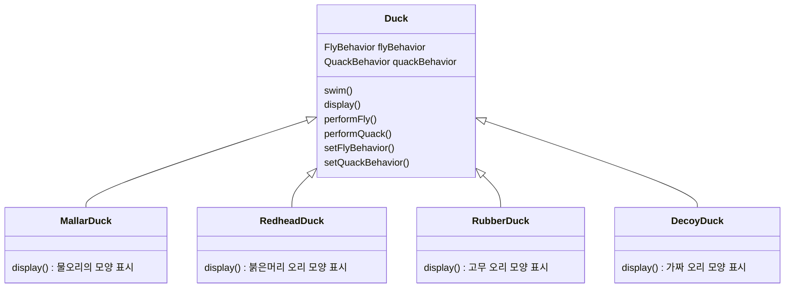
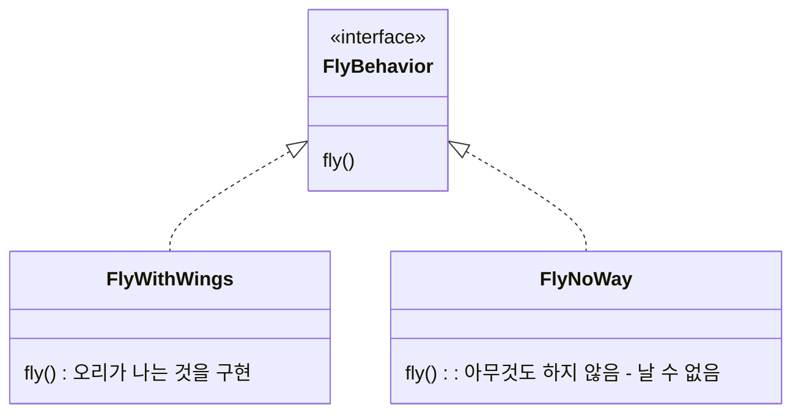
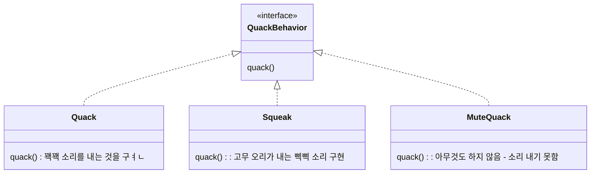

# Strategy Pattern

- 알고리즘군을 정의하고 각각을 캡슐화하여 교환해서 사용할 수 있도록 만듬
- algorithm을 사용하는 client와는 독립적으로 algorithm을 변경할 수 있음

---

# Example : 오리 Class

- client에서는 '나는 행동'과 '꽥꽥거리는 행동' 모두에 대해서 캡슐화된 알고리즘군을 '활용'함
    - client는 setter로 행동 변수를 설정하고 perform 함수를 사용하면 됨
        - ex) setFlyBehavior() -> performFly()
- 각 행동의 집합을 알고리즘군으로 생각하면 됨

## Client

## 캡슐화된 나는 행동

## 캡슐화된 꽥꽥거리는 행동

---

# Reference

- Head First Design Patterns