# Chatting System 설계


---


## Chatting System의 구성

### 1. Chatting Service : Client 간 통신, Message 저장

### 2. API Service : Login/Logout, 회원 가입, 사용자 Profile 표시, Service 탐색

### 3. Third-Party Service : Push 알림

<br>
<br>

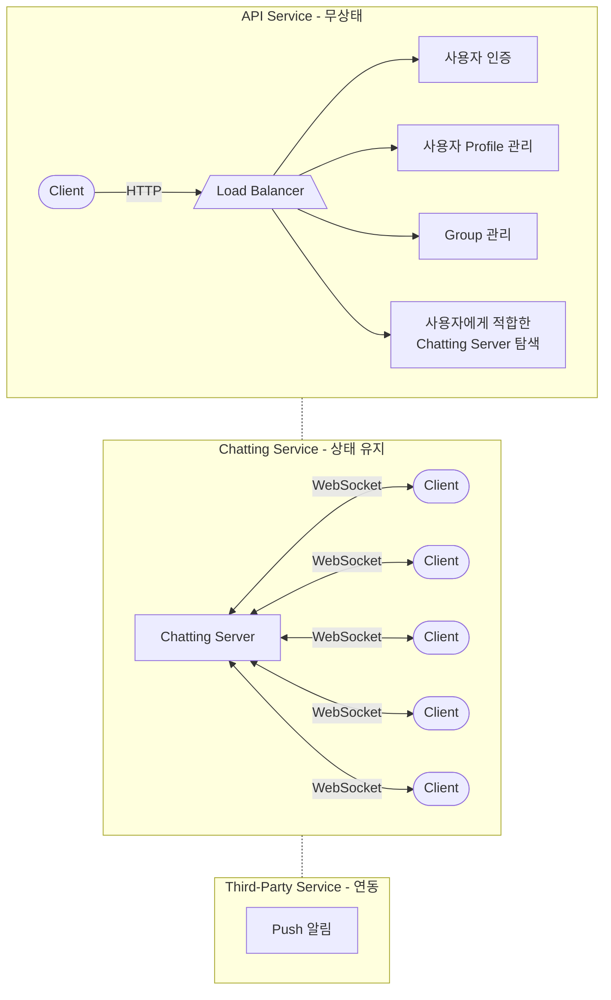


---


## Chatting Message 처리 흐름

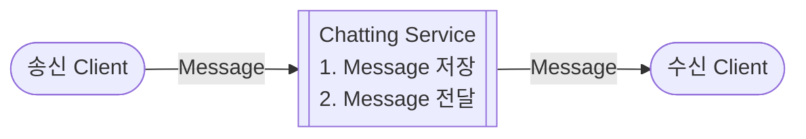


---


### 1:1 Chatting Message 처리 흐름

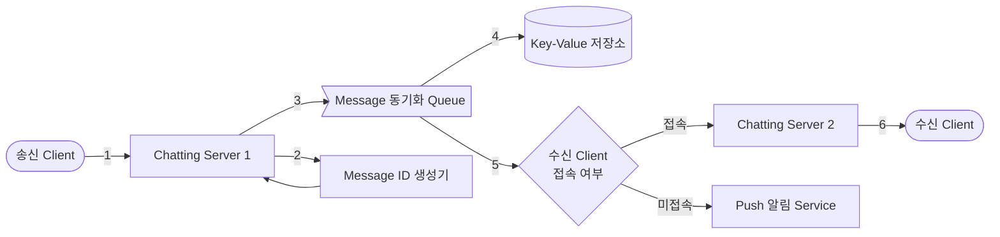

1. `송신 Client`가 `Chatting Server 1`로 Message 전송
2. `Chatting Server 1`은 `ID 생성기`를 사용해 'message ID' 결정
3. 해당 Message를 `Message 동기화 Queue`로 전송
4. Message를 `Key-Value 저장소`에 보관
5. `수신 Client`의 접속 여부에 따라 Message 전송 방식을 결정하고 처리
6. `수신 Client`와 `Chatting Server 2` 사이에 연결된 WebSocket을 통해 Message 전송


---


### Group Chatting Message 처리 흐름 : Message를 여러 Client에게 송신하는 경우

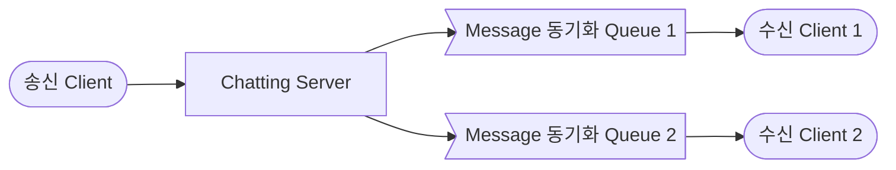

### Group Chatting Message 처리 흐름 : Message를 여러 Client로부터 수신하는 경우

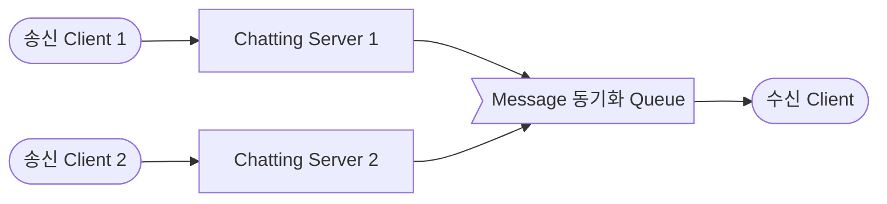


---


## Client와 Chatting Server 간의 연결 유지하기


### HTTP 통신

- Client가 Server와의 연결을 생성하고 요청 (대부분의 Client/Server Application)
- 송신 Client가 Message를 Chatting Server에 보낼 때 사용 가능


### Chatting System에서 HTTP 통신의 한계

- 수신 Client와 Server와의 관계는 일반적인 HTTP 통신만으로 구현할 수 없음
    - 일반적인 HTTP의 통신 방향에 반대되는 요청


### 해결 방법

- Network 연결을 끊지 않고 유지하는 방식
    - 또는 실제로 연결은 끊어지지만, 지속적으로 요청하여 끊어지지 않은 것처럼 보이게 하는 기법 사용


---


### 1. Polling

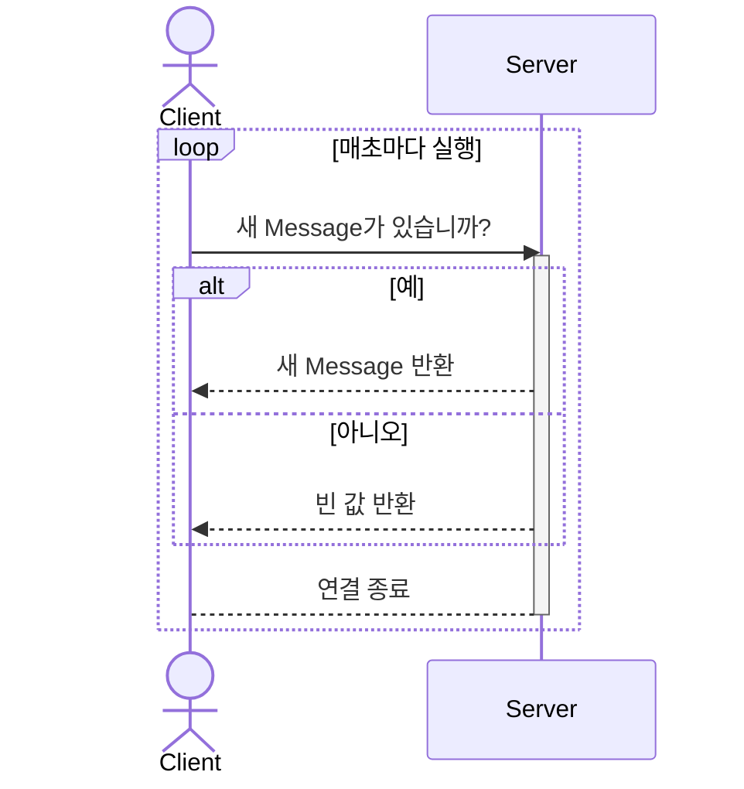


---


### 2. Long Polling

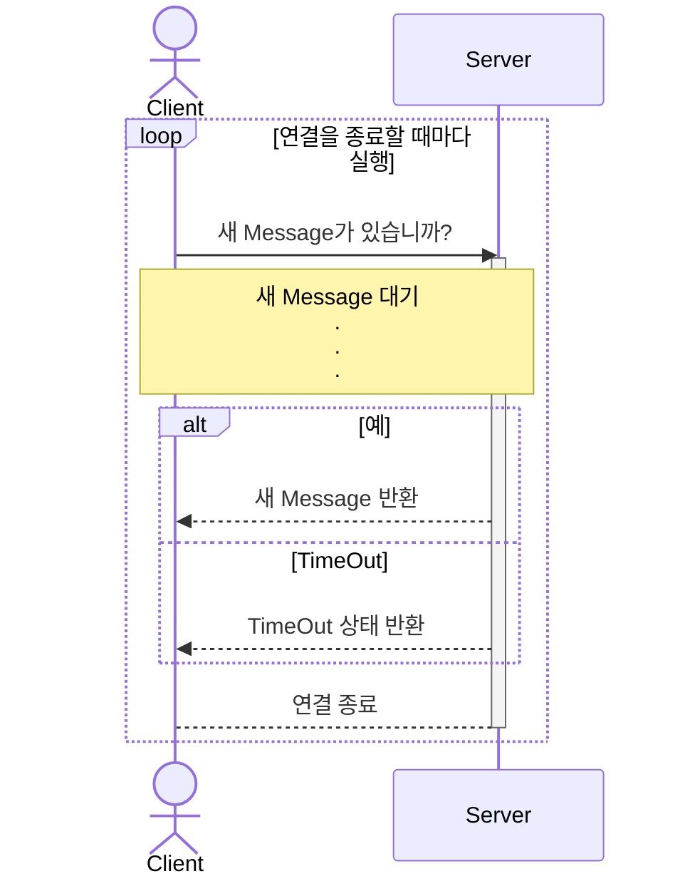


---


### 3. WebSocket (권장)

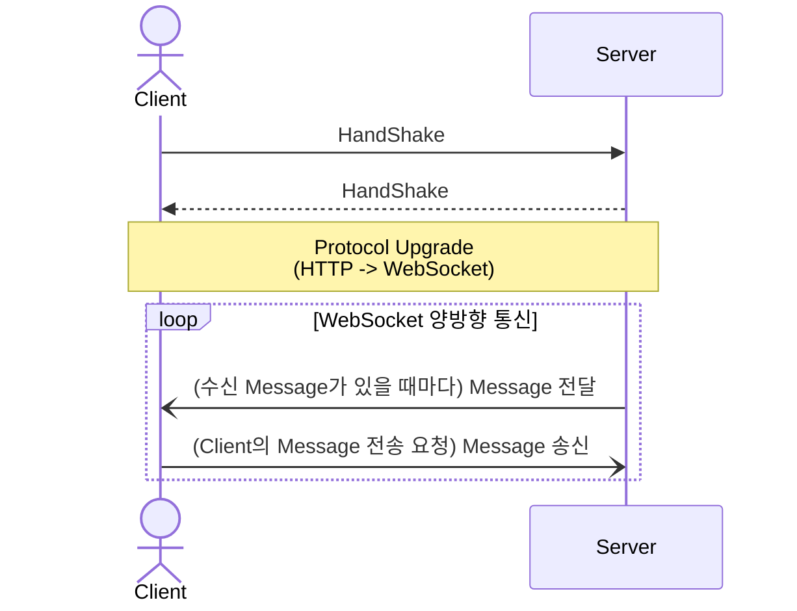


---


## Chatting System Database

### 1. 일반적인 Data : 사용자 Profile, 설정, 친구 목록 -> 관계형 Database

- 안정성 보장

### 2. Chatting Data : 대화 이력 -> Key-value 저장소

- 수평적 규모 확장이 쉬움
- Data 접근 지연 시간이 낮음


---


### Chatting Message Data Model

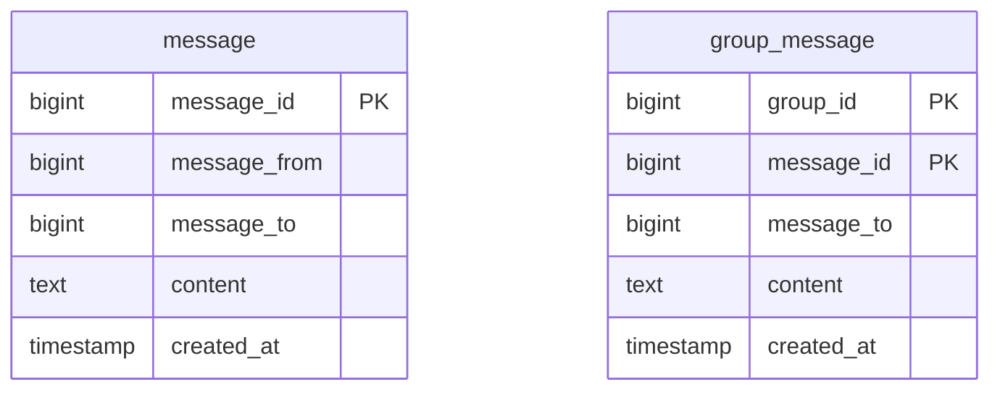


### `message_id` : Sequencial Primary Key

- 시간 순서와 일치해야 함 : 조회 및 동기화 시의 편의를 위한 조건

- RDBMS의 `auto_increment` : Key-Value 저장소에는 없음

- 순서 번호 생성기(Sequence Number Generator) 사용
    - e.g., Snowflake


```sql
-- 1:1 Chatting
SELECT * FROM message
WHERE message_id > [cur_max_message_id];

-- Group Chatting
SELECT * FROM group_message
WHERE group_id = [group_id] AND message_id > [cur_max_message_id];

-- chat history는 key-value 저장소에 보관하지만, 조회 예시는 가독성을 위해 query로 작성함
```

- `cur_max_message_id` : 사용자의 단말기에서 가장 최신 `message_id`를 추적하는 변수


---
---
---
---
---
---


# 사용자 접속 상태 표시


<br>
<br>
<br>

<svg>
    <circle cx="50" cy="50" r="50" fill="#40c613" />
</svg>


---


### Login

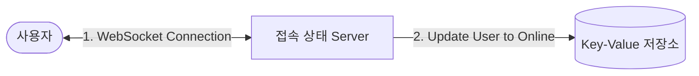

```json
{
    "user_id": {
        "status": "online",    // online으로 갱신
        "last_active_at": "2024-02-21 10:21:39",    // 현재 시간으로 갱신
    }
}
```

<br>
<br>

### Logout

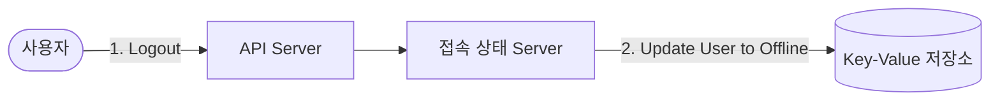

```json
{
    "user_id": {
        "status": "offline",    // offline으로 갱신
        "last_active_at": "2024-02-21 10:21:39",    // 갱신하지 않음
    }
}
```


---


## 접속 장애

- 불안정한 Internet 연결


### 박동 이벤트 (Heartbeat Event)

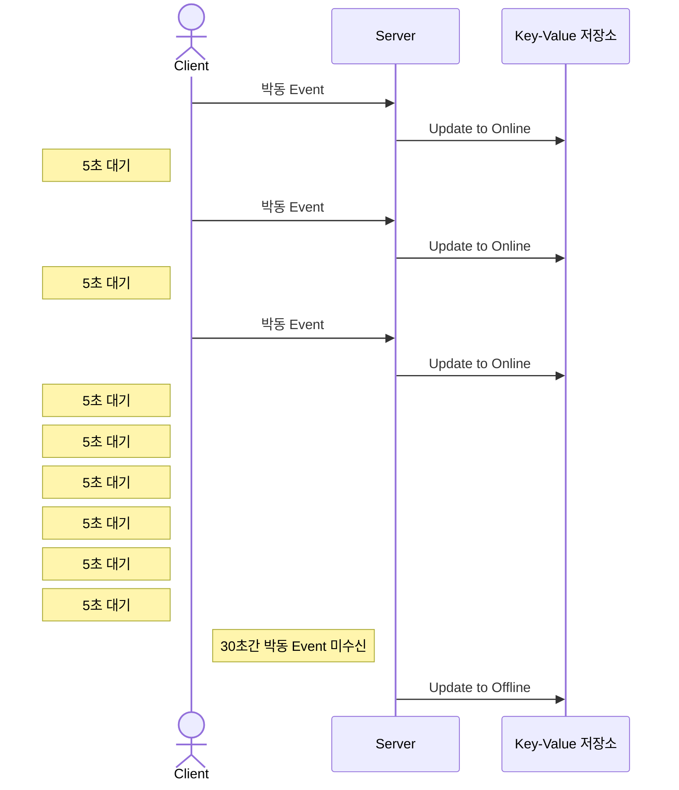


---


## 상태 정보의 전송

- 친구나 Follower가 사용자의 접속 상태 변화를 알아야 함


### 발행-구독 모델 (Publish–Subscribe Model)

- Group 크기가 작을 때 사용할 수 있는 방법

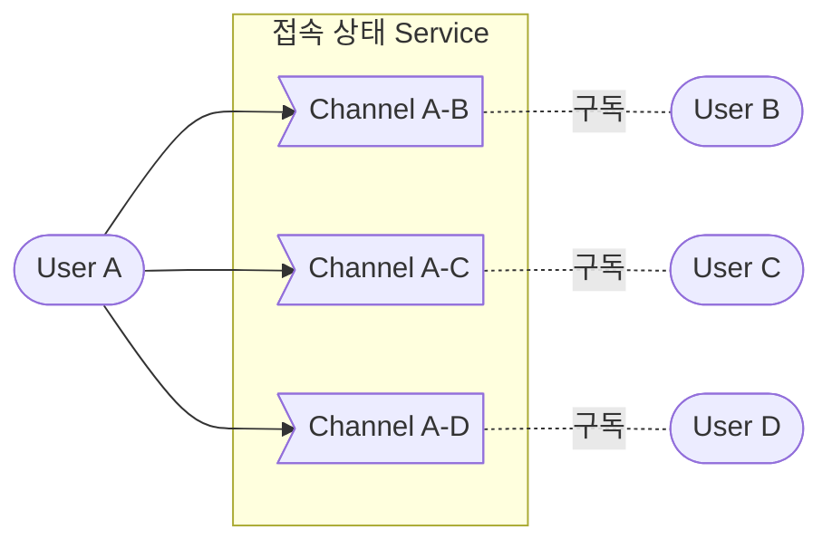


---


# 과제

### 1. 사진이나 비디오 등의 미디어 지원 방법

### 2. 종단 간 Message 암호화

### 3. 한 사용자의 여러 단말 간 Message 동기화

- 휴대폰, 컴퓨터 등


---
---
---
---
---


# Reference

- 가상 면접 사례로 배우는 대규모 시스템 설계 기초 (도서) - Alex Xu, 이병준


