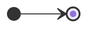
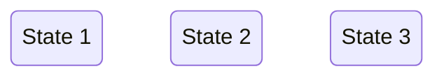
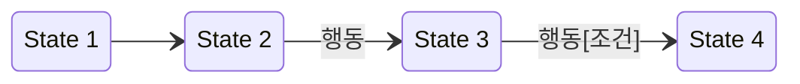
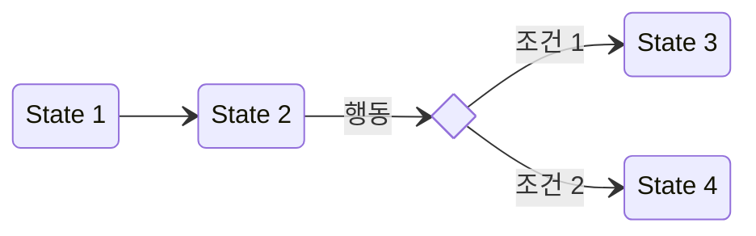
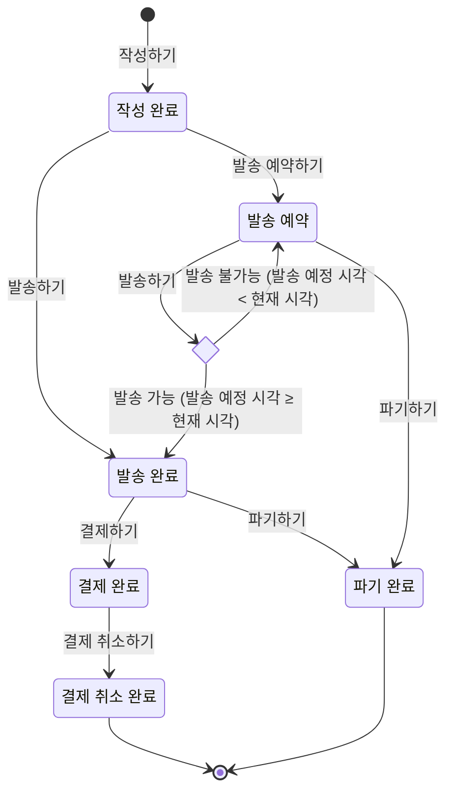
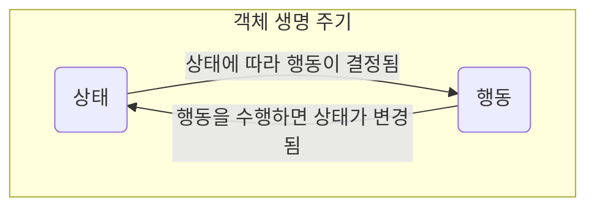
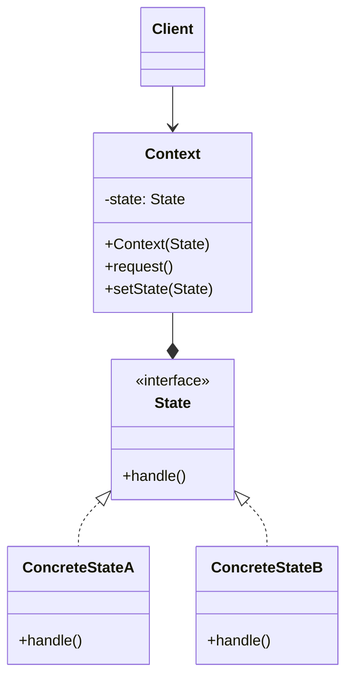
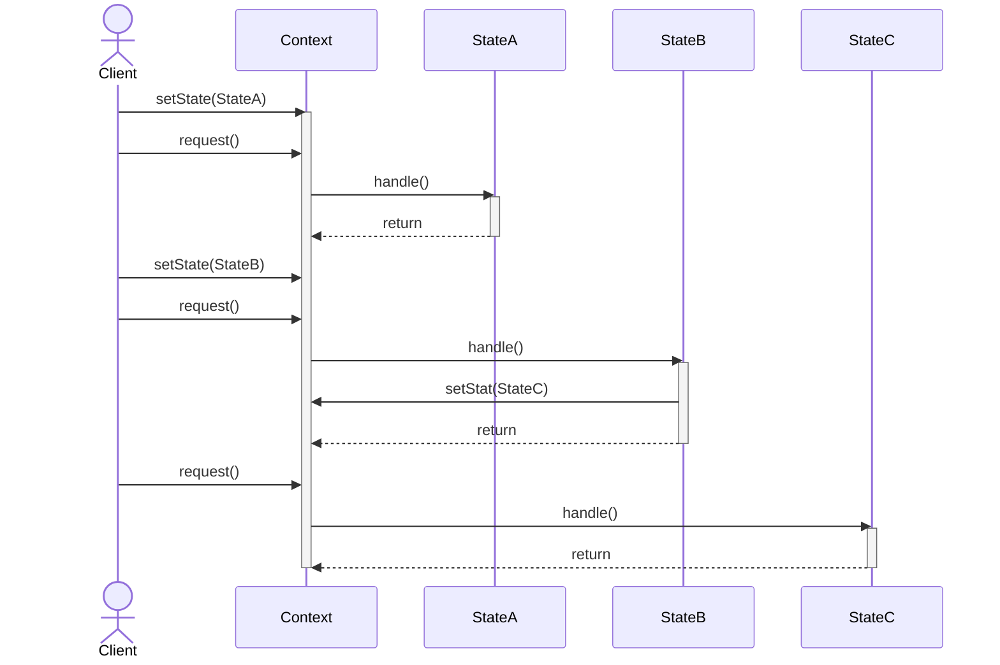
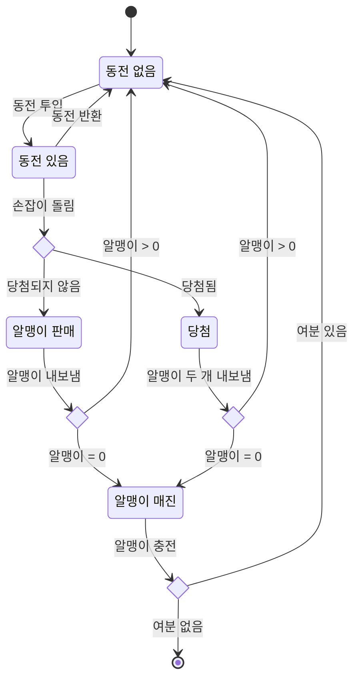
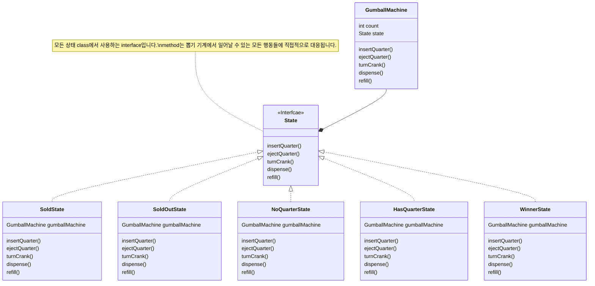

# 유한 상태 기계


### 하나의 객체가 생명 주기 동안 가질 수 있는 상태의 변화


---


## 시작 상태와 종료 상태




---


## 상태




---


## 전이




---


## 선택




---





---


# 상태 기계 작성 주의 사항


## '하나'의 객체에 대한 상태


## 블랙홀 상태 주의하기


---
---


# State Pattern


## 객체의 상태에 따라 행동 바꾸기


---


## 상태 : 특정 시점에 가질 수 있는 모든 가능한 조건이나 상황


### 변수의 값

### 객체의 속성

### 시스템 설정


---


## State Pattern의 '상태'

#### 객체의 행동을 결정하는 내부 조건이나 구성

- 상태는 객체가 가진 정보(data)와 그 정보를 처리하는 방법(행위)에 의해 결정됨




---


## State Pattern 구현

```java
class Context {
    State state;

    void setState(State state) {
        this.state = state;
    }

    void request() {
        state.handle(this);    // state 객체에 처리를 위임함
    }
}
```

```java
interface State {
    void handle(Context context);
}

class ConcreteStateA implements State {
    @Override
    public void handle(Context context) {
        // ...
    }
}

class ConcreteStateB implements State {
    @Override
    public void handle(Context context) {
        // ...
        context.setState(ConcreteStateC.getInstance());    // 상태에서 동작을 실행한 후 바로 다른 상태로 바꾸기도 함
    }
}

class ConcreteStateC implements State {
    @Override
    public void handle(Context context) {
        // ...
    }
}
```




---


## State Pattern 사용 흐름

```java
class Client {
    public static void main(String[] args) {
        Context context = new Context();

        // 1. StateA 상태 설정
        context.setState(new ConcreteStateA());

        // 2. 현재 StateA 상태에 맞는 method 실행
        context.request();

        // 3. StateB 상태 설정
        context.setState(new ConcreteStateB());

        // 4. StateB 상태에서 다시 StateC 상태로 변경
        context.request();

        // 5. StateC 상태에 맞는 method 실행
        context.request();
    }
}
```




---


## 비슷하지만 다른 Strategy Pattern과 State Pattern

| Strategy Pattern | State Pattern |
| --- | --- |
| **행동**을 객체화 | **상태**를 객체화 |
| **Context 객체가 행동을 결정** | **State 객체가 행동을 결정** |
| 전략 객체는 **그 전략만의 알고리즘 동작을 정의 및 수행**함 | 상태 객체는 상태가 적용되는 **대상 객체가 할 수 있는 모든 행동들을 정의 및 수행 |


---


## Example : 뽑기 기계

- 동전을 넣고 손잡이를 돌리면 알맹이가 1개 나오는 기계
- 10% 확률로 당첨되면 알맹이를 2개 받음






### Test Code

```java
public class GumballMachineTestDrive {
    public static void main(String[] args) {
        GumballMachine gumballMachine = new GumballMachine(10);

        System.out.println(gumballMachine);

        gumballMachine.insertQuarter();
        gumballMachine.turnCrank();
        gumballMachine.insertQuarter();
        gumballMachine.turnCrank();

        System.out.println(gumballMachine);

        gumballMachine.insertQuarter();
        gumballMachine.turnCrank();
        gumballMachine.insertQuarter();
        gumballMachine.turnCrank();

        System.out.println(gumballMachine);

        gumballMachine.insertQuarter();
        gumballMachine.turnCrank();
        gumballMachine.insertQuarter();
        gumballMachine.turnCrank();

        System.out.println(gumballMachine);

        gumballMachine.insertQuarter();
        gumballMachine.turnCrank();
        gumballMachine.insertQuarter();
        gumballMachine.turnCrank();

        System.out.println(gumballMachine);

        gumballMachine.insertQuarter();
        gumballMachine.turnCrank();
        gumballMachine.insertQuarter();
        gumballMachine.turnCrank();

        System.out.println(gumballMachine);
    }
}
```


### Context

```java
public class GumballMachine {
 
    State soldOutState;
    State noQuarterState;
    State hasQuarterState;
    State soldState;
    State winnerState;
 
    State state = soldOutState;
    int count = 0;
 
    public GumballMachine(int numberGumballs) {
        soldOutState = new SoldOutState(this);
        noQuarterState = new NoQuarterState(this);
        hasQuarterState = new HasQuarterState(this);
        soldState = new SoldState(this);
        winnerState = new WinnerState(this);

        this.count = numberGumballs;
         if (numberGumballs > 0) {
            state = noQuarterState;
        } 
    }
 
    public void insertQuarter() {
        state.insertQuarter();
    }
 
    public void ejectQuarter() {
        state.ejectQuarter();
    }
 
    public void turnCrank() {
        state.turnCrank();
        state.dispense();
    }

    void setState(State state) {
        this.state = state;
    }
 
    void releaseBall() {
        System.out.println("A gumball comes rolling out the slot...");
        if (count > 0) {
            count = count - 1;
        }
    }
 
    int getCount() {
        return count;
    }
 
    void refill(int count) {
        this.count += count;
        System.out.println("The gumball machine was just refilled; its new count is: " + this.count);
        state.refill();
    }

    public State getState() {
        return state;
    }

    public State getSoldOutState() {
        return soldOutState;
    }

    public State getNoQuarterState() {
        return noQuarterState;
    }

    public State getHasQuarterState() {
        return hasQuarterState;
    }

    public State getSoldState() {
        return soldState;
    }

    public State getWinnerState() {
        return winnerState;
    }
 
    public String toString() {
        StringBuffer result = new StringBuffer();
        result.append("\nMighty Gumball, Inc.");
        result.append("\nJava-enabled Standing Gumball Model #2004");
        result.append("\nInventory: " + count + " gumball");
        if (count != 1) {
            result.append("s");
        }
        result.append("\n");
        result.append("Machine is " + state + "\n");
        return result.toString();
    }
}
```


### State

```java
public interface State {
 
    public void insertQuarter();
    public void ejectQuarter();
    public void turnCrank();
    public void dispense();
    
    public void refill();
}
```

```java
public class SoldState implements State {
    GumballMachine gumballMachine;
 
    public SoldState(GumballMachine gumballMachine) {
        this.gumballMachine = gumballMachine;
    }
       
    public void insertQuarter() {
        System.out.println("Please wait, we're already giving you a gumball");
    }
 
    public void ejectQuarter() {
        System.out.println("Sorry, you already turned the crank");
    }
 
    public void turnCrank() {
        System.out.println("Turning twice doesn't get you another gumball!");
    }
 
    public void dispense() {
        gumballMachine.releaseBall();
        if (gumballMachine.getCount() > 0) {
            gumballMachine.setState(gumballMachine.getNoQuarterState());
        } else {
            System.out.println("Oops, out of gumballs!");
            gumballMachine.setState(gumballMachine.getSoldOutState());
        }
    }
    
    public void refill() { }
 
    public String toString() {
        return "dispensing a gumball";
    }
}
```

```java
public class SoldOutState implements State {
    GumballMachine gumballMachine;
 
    public SoldOutState(GumballMachine gumballMachine) {
        this.gumballMachine = gumballMachine;
    }
 
    public void insertQuarter() {
        System.out.println("You can't insert a quarter, the machine is sold out");
    }
 
    public void ejectQuarter() {
        System.out.println("You can't eject, you haven't inserted a quarter yet");
    }
 
    public void turnCrank() {
        System.out.println("You turned, but there are no gumballs");
    }
 
    public void dispense() {
        System.out.println("No gumball dispensed");
    }
    
    public void refill() { 
        gumballMachine.setState(gumballMachine.getNoQuarterState());
    }
 
    public String toString() {
        return "sold out";
    }
}
```

```java
import java.util.Random;

public class HasQuarterState implements State {
    Random randomWinner = new Random(System.currentTimeMillis());
    GumballMachine gumballMachine;
 
    public HasQuarterState(GumballMachine gumballMachine) {
        this.gumballMachine = gumballMachine;
    }
  
    public void insertQuarter() {
        System.out.println("You can't insert another quarter");
    }
 
    public void ejectQuarter() {
        System.out.println("Quarter returned");
        gumballMachine.setState(gumballMachine.getNoQuarterState());
    }
 
    public void turnCrank() {
        System.out.println("You turned...");
        int winner = randomWinner.nextInt(10);
        if ((winner == 0) && (gumballMachine.getCount() > 1)) {
            gumballMachine.setState(gumballMachine.getWinnerState());
        } else {
            gumballMachine.setState(gumballMachine.getSoldState());
        }
    }

    public void dispense() {
        System.out.println("No gumball dispensed");
    }
    
    public void refill() { }
 
    public String toString() {
        return "waiting for turn of crank";
    }
}
```

```java
public class NoQuarterState implements State {
    GumballMachine gumballMachine;
 
    public NoQuarterState(GumballMachine gumballMachine) {
        this.gumballMachine = gumballMachine;
    }
 
    public void insertQuarter() {
        System.out.println("You inserted a quarter");
        gumballMachine.setState(gumballMachine.getHasQuarterState());
    }
 
    public void ejectQuarter() {
        System.out.println("You haven't inserted a quarter");
    }
 
    public void turnCrank() {
        System.out.println("You turned, but there's no quarter");
     }
 
    public void dispense() {
        System.out.println("You need to pay first");
    } 
    
    public void refill() { }
 
    public String toString() {
        return "waiting for quarter";
    }
}
```

```java
public class WinnerState implements State {
    GumballMachine gumballMachine;
 
    public WinnerState(GumballMachine gumballMachine) {
        this.gumballMachine = gumballMachine;
    }
 
    public void insertQuarter() {
        System.out.println("Please wait, we're already giving you a Gumball");
    }
 
    public void ejectQuarter() {
        System.out.println("Please wait, we're already giving you a Gumball");
    }
 
    public void turnCrank() {
        System.out.println("Turning again doesn't get you another gumball!");
    }
 
    public void dispense() {
        gumballMachine.releaseBall();
        if (gumballMachine.getCount() == 0) {
            gumballMachine.setState(gumballMachine.getSoldOutState());
        } else {
            gumballMachine.releaseBall();
            System.out.println("YOU'RE A WINNER! You got two gumballs for your quarter");
            if (gumballMachine.getCount() > 0) {
                gumballMachine.setState(gumballMachine.getNoQuarterState());
            } else {
                System.out.println("Oops, out of gumballs!");
                gumballMachine.setState(gumballMachine.getSoldOutState());
            }
        }
    }
 
    public void refill() { }
    
    public String toString() {
        return "despensing two gumballs for your quarter, because YOU'RE A WINNER!";
    }
}
```

### Context without State Pattern

```java
public class GumballMachine {
 
    final static int SOLD_OUT = 0;
    final static int NO_QUARTER = 1;
    final static int HAS_QUARTER = 2;
    final static int SOLD = 3;
 
    int state = SOLD_OUT;
    int count = 0;
  
    public GumballMachine(int count) {
        this.count = count;
        if (count > 0) {
            state = NO_QUARTER;
        }
    }
  
    public void insertQuarter() {
        if (state == HAS_QUARTER) {
            System.out.println("You can't insert another quarter");
        } else if (state == NO_QUARTER) {
            state = HAS_QUARTER;
            System.out.println("You inserted a quarter");
        } else if (state == SOLD_OUT) {
            System.out.println("You can't insert a quarter, the machine is sold out");
        } else if (state == SOLD) {
            System.out.println("Please wait, we're already giving you a gumball");
        }
    }

    public void ejectQuarter() {
        if (state == HAS_QUARTER) {
            System.out.println("Quarter returned");
            state = NO_QUARTER;
        } else if (state == NO_QUARTER) {
            System.out.println("You haven't inserted a quarter");
        } else if (state == SOLD) {
            System.out.println("Sorry, you already turned the crank");
        } else if (state == SOLD_OUT) {
            System.out.println("You can't eject, you haven't inserted a quarter yet");
        }
    }
 
    public void turnCrank() {
        if (state == SOLD) {
            System.out.println("Turning twice doesn't get you another gumball!");
        } else if (state == NO_QUARTER) {
            System.out.println("You turned but there's no quarter");
        } else if (state == SOLD_OUT) {
            System.out.println("You turned, but there are no gumballs");
        } else if (state == HAS_QUARTER) {
            System.out.println("You turned...");
            state = SOLD;
            dispense();
        }
    }
 
    private void dispense() {
        if (state == SOLD) {
            System.out.println("A gumball comes rolling out the slot");
            count = count - 1;
            if (count == 0) {
                System.out.println("Oops, out of gumballs!");
                state = SOLD_OUT;
            } else {
                state = NO_QUARTER;
            }
        } else if (state == NO_QUARTER) {
            System.out.println("You need to pay first");
        } else if (state == SOLD_OUT) {
            System.out.println("No gumball dispensed");
        } else if (state == HAS_QUARTER) {
            System.out.println("No gumball dispensed");
        }
    }
 
    public void refill(int numGumBalls) {
        this.count = numGumBalls;
        state = NO_QUARTER;
    }

    public String toString() {
        StringBuffer result = new StringBuffer();
        result.append("\nMighty Gumball, Inc.");
        result.append("\nJava-enabled Standing Gumball Model #2004\n");
        result.append("Inventory: " + count + " gumball");
        if (count != 1) {
            result.append("s");
        }
        result.append("\nMachine is ");
        if (state == SOLD_OUT) {
            result.append("sold out");
        } else if (state == NO_QUARTER) {
            result.append("waiting for quarter");
        } else if (state == HAS_QUARTER) {
            result.append("waiting for turn of crank");
        } else if (state == SOLD) {
            result.append("delivering a gumball");
        }
        result.append("\n");
        return result.toString();
    }
}
```


---
---
---
---
---


# Reference

- Head First Design Patterns (도서) - Eric Freeman, Elisabeth Robson, Bert Bates, Kathy Sierra
- <https://inpa.tistory.com/entry/GOF-💠-상태State-pattern-제대로-배워보자>
- <https://refactoring.guru/ko/design-patterns/state>


