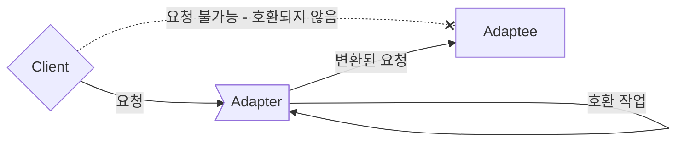
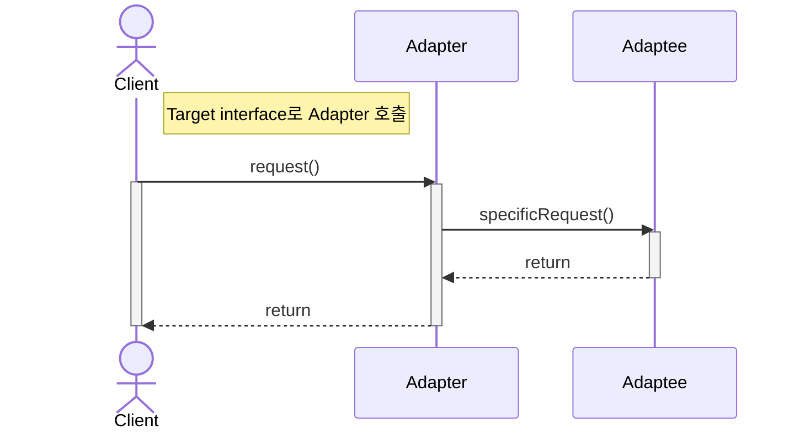
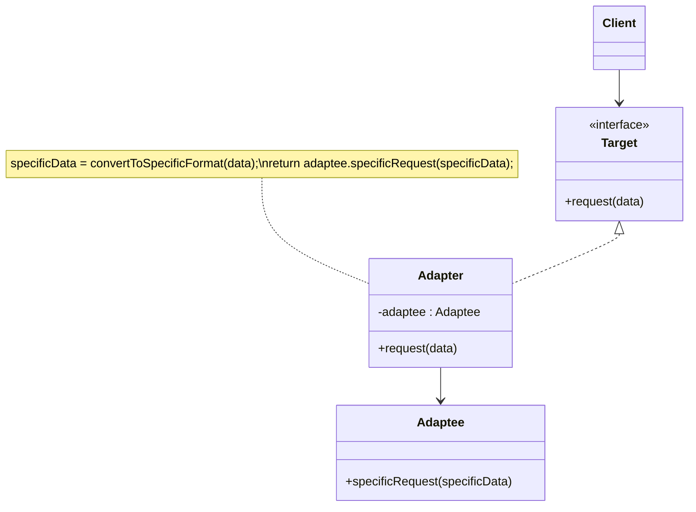
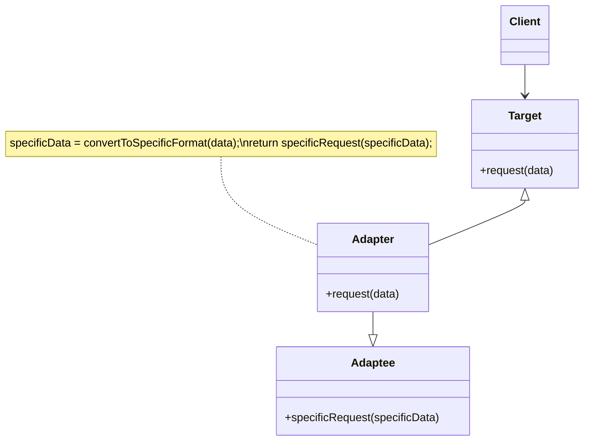
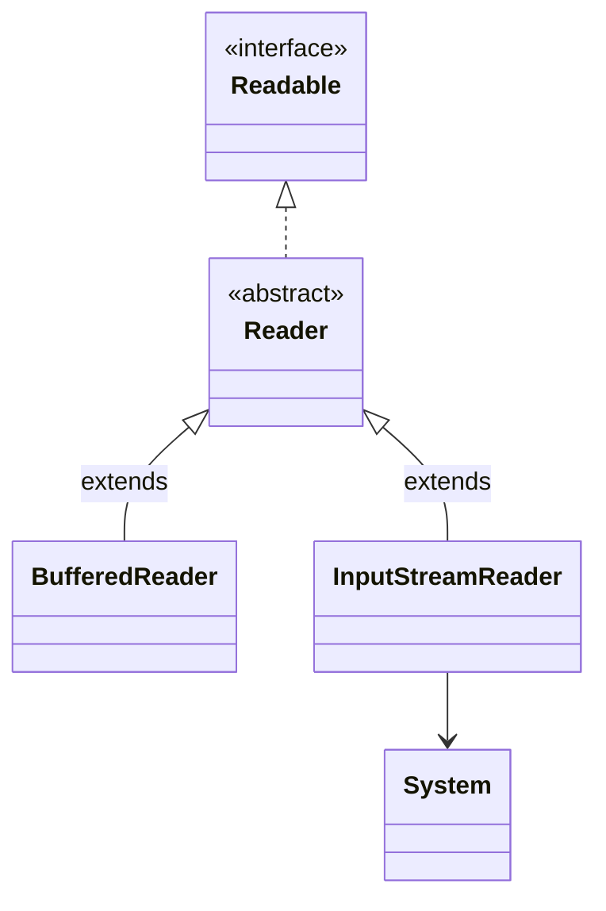
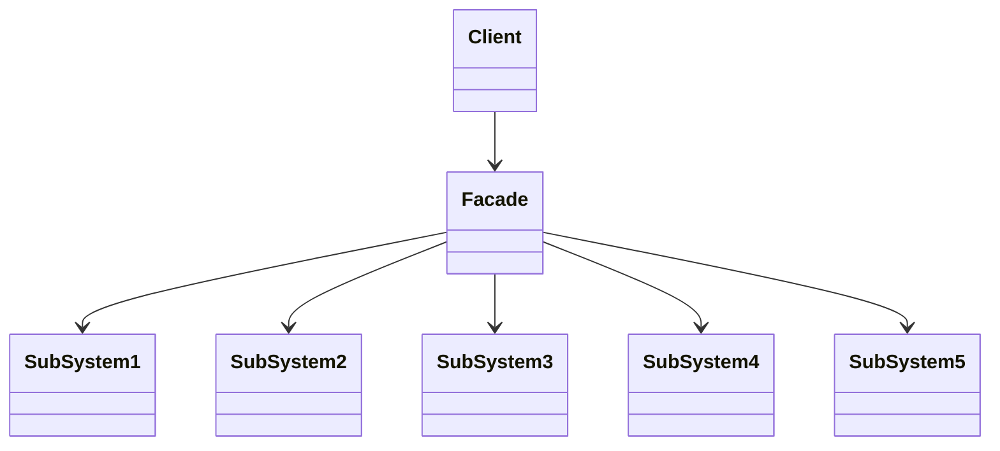
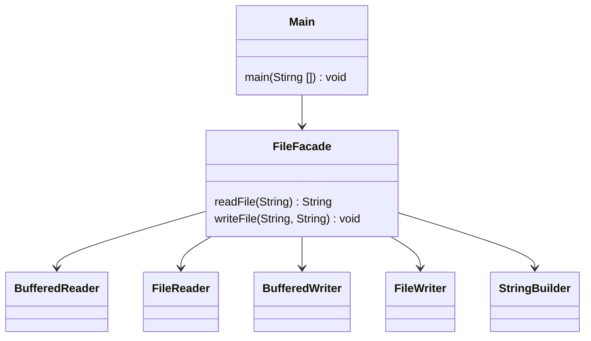

# Adapter Pattern


---


## 서로 다른 인터페이스를 가지는 두 객체를 연결




---


## Adapter 동작 순서




- `Client` : Adaptee의 기능을 사용하려는 주체
- `Target` : Client가 접근해서 사용할 고수준의 Adapter Module
- `Adapter` : Client와 Adaptee 사이에서 실질적인 호환 작업을 맡는 객체
- `Adaptee` : Client가 최종적으로 사용하고자 하는 서비스이자 Adapter의 호환 작업 대상


---


## Object Adapter : 합성을 이용해 구현한 Adapter



```java
class Client {
    public static void main(String[] args) {
        Target adapter = new Adapter(new Adaptee());    // Adaptee를 인자로 받아 호환 작업을 처리합니다.
        adapter.request(1);    // Target interface의 명세에 따라 method를 호출하여 Adaptee를 사용합니다.
    }
}
```

```java
interface Target {
    void request(int data);    // Client는 Adaptee를 사용하기 위해 이 method에 접근합니다.
}
```

```java
class Adapter implements Target {
    Adaptee adaptee;    // Adaptee 객체를 class field로 합성(composition)합니다.

    Adapter(Adaptee adaptee) {
        this.adaptee = adaptee;    // Adapter를 생성할 때 호환시킬 기존 서비스를 설정합니다.
    }

    public void request(int data) {
        adaptee.specificRequest(data);    // Adapter의 method가 호출되면, Adaptee의 method를 호출하도록 위임합니다.
    }
}
```

```java
class Adaptee {
    void specificRequest(int specificData) {
        System.out.println("Process Adaptee service with " + specificData);
    }
}
```


---


## Class Adapter : 상속을 이용해 구현한 Adapter




```java
class Client {
    public static void main(String[] args) {
        Target adapter = new Adapter();    // Object Adapter와 달리 Adaptee를 인자로 받을 필요가 없습니다.
        adapter.request(1);
    }
}
```

```java
interface Target {
    void request(int data);
}
```

```java
class Adapter extends Adaptee implements Target {
    public void request(int data) {
        specificRequest(data);    // Adapter의 method가 호출되면, 상속받은 부모 class인 Adaptee의 method를 호출합니다.
    }
}
```

```java
class Adaptee {
    void specificRequest(int specificData) {
        System.out.println("Process Adaptee service with " + specificData);
    }
}
```


---


## Adapter Pattern Example : Java InputStreamReader


```java
// Client Code
BufferedReader br = new BufferedReader(new InputStreamReader(System.in));

// BufferedReader의 생성자 parameter는 Reader
public BufferedReader(Reader in) {
    this(in, defaultCharBufferSize);
}

// System.in가 반환하는 자료형은 InputStream
public final static InputStream in = null;
```




---
---


# Facade Pattern


---


## 복잡한 시스템에 대한 단순한 인터페이스 제공




- `Facade` : 더 사용하기 편한 통합 인터페이스
- `SubSystem` : 복잡한 하위 시스템


---


## Example : File Reader





### Facade

```java
class FileFacade {
    public String readFile(String fileName) {
        try (BufferedReader reader = new BufferedReader(new FileReader(fileName))) {
            StringBuilder stringBuilder = new StringBuilder();
            String line = null;
            while ((line = reader.readLine()) != null) {
                stringBuilder.append(line);
                stringBuilder.append(System.lineSeparator());
            }
            return stringBuilder.toString();
        } catch (IOException e) {
            e.printStackTrace();
            return null;
        }
    }

    public void writeFile(String fileName, String content) {
        try (BufferedWriter writer = new BufferedWriter(new FileWriter(fileName))) {
            writer.write(content);
        } catch (IOException e) {
            e.printStackTrace();
        }
    }
}
```


### Client

```java
public class Main {
    public static void main(String[] args) {
        FileFacade fileFacade = new FileFacade();
        String fileName = "test.txt";
        String content = "Hello, World!";

        // 파일 쓰기
        fileFacade.writeFile(fileName, content);

        // 파일 읽기
        String readContent = fileFacade.readFile(fileName);
        System.out.println(readContent);
    }
}
```


---


## Adapter Pattern & Facade pattern & Decorator Pattern

>객체를 감싸서 호환되지 않는 인터페이스를 Client가 사용할 수 있게 합니다.


### Adapter Pattern : 인터페이스를 다른 인터페이스로 변환


### Facade pattern : 인터페이스를 단순하게 바꿈


### Decorator Pattern : 인터페이스는 바꾸지 않고 기능만 추가


---


# Reference

- Head First Design Patterns - Eric Freeman, Elisabeth Robson, Bert Bates, Kathy Sierra
- <https://inpa.tistory.com/entry/GOF-💠-어댑터Adaptor-패턴-제대로-배워보자>
- <https://yaboong.github.io/design-pattern/2018/10/15/adapter-pattern>
- <https://refactoring.guru/ko/design-patterns/adapter>
- <https://shan0325.tistory.com/23>


