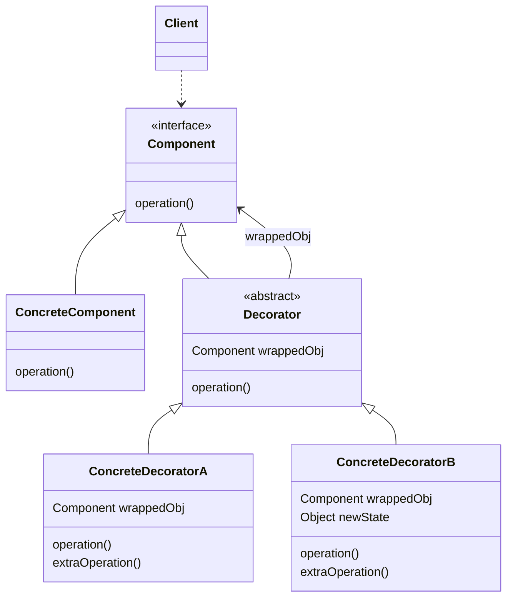
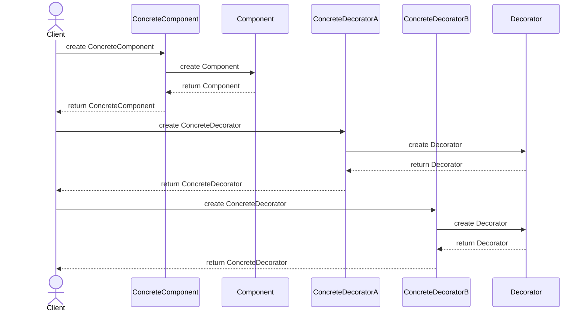
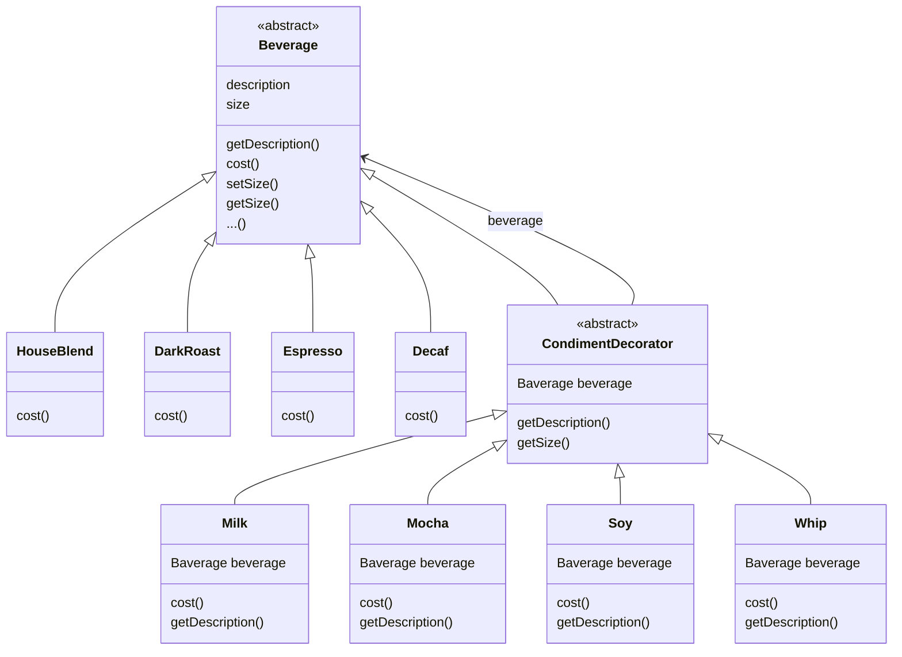

# Decorator Pattern
## 객체의 기능을 동적으로 확장하기

  


---


# 예시 : 옷 입기


---


```java
interface Component {
    void operation();
}

class ConcreteComponent implements Component {
    public void operation() {
        // ...
    }
}

abstract class Decorator implements Component {
    Component wrappedObj;

    Decorator(Component component) {
        this.wrappedObj = component;
    }

    public void operation() {
        wrappedObj.operation();
    }
}

class ConcreteDecoratorA extends Decorator {

    ConcreteDecoratorA(Component component) {
        super(component);
    }

    public void operation() {
        super.operation();
        extraOperation();
    }

    void extraOperation() {
        // ...
    }
}

class ConcreteDecoratorB extends Decorator {

    ConcreteDecoratorB(Component component) {
        super(component);
    }

    public void operation() {
        super.operation();
        extraOperation();
    }

    void extraOperation() {
        // ...
    }
}
```


---





---


```java
Component decoratedComponenet = new ConcreteDecoratorB(new ConcreteDecoratorA(new ConcreteComponent()));
```




---


# Decorator Pattern의 상속

- 상속은 단지 **형식을 맞추기 위한 것**
- 새로운 행동은 **위임과 합성**을 통해서 얻음


---


# 사용해야 할 때

1. 객체 책임과 행동이 상황에 따라 동적으로 빈번하게 추가/삭제되는 경우
2. 객체의 결합을 통해 기능이 생성될 수 있는 경우
3. 객체를 사용하는 코드를 손상시키지 않고 런타임에 객체에 추가 동작을 할당할 수 있어야 하는 경우
4. 상속을 통해 자식 클래스를 만들어 객체의 동작을 확장하는 것이 어색하거나 불가능한 경우


---


# 장점

1. 자식 클래스를 만드는 방식보다 더 유연한 기능을 확장
2. 여러 decorator로 감싸서 여러 행동들을 합성할 수 있음
3. 동적으로 기능을 변경할 수 있음
4. 단일 책임 원칙(SRP) 준수
5. 개방 폐쇄 원칙(OCP)을 준수
6. 의존 역전 원칙(DIP)을 준수


---


# 단점

1. 추가한 기능들 중 일부를 제거하기 어려움
2. decorator를 너무 많이 사용하면 코드가 필요 이상으로 복잡해짐
3. decorator를 조합하는 초기 생성 코드가 보기 흉함
    - `new A(new B(new C(new D())));`
4. decorator의 행동이 decorator 내의 순서에 의존하지 않는 방식으로 구현하기 어려움


---


# Example : 음료에 첨가물을 추가하고 가격 계산하기

- 음료(Beverage)에 첨가물(Shot, Syrup, Milk, Whip)을 동적으로 추가하고, 첨가물의 가격이 포함된 음료의 가격을 계산하기





---


## Main

```java
public class StarbuzzCoffee {
 
    public static void main(String args[]) {
        Beverage beverage = new Espresso();
        System.out.println(beverage.getDescription() + " $" + String.format("%.2f", beverage.cost()));
 
        Beverage beverage2 = new DarkRoast();
        beverage2 = new Mocha(beverage2);
        beverage2 = new Mocha(beverage2);
        beverage2 = new Whip(beverage2);
        System.out.println(beverage2.getDescription() + " $" + String.format("%.2f", beverage2.cost()));
 
        Beverage beverage3 = new HouseBlend();
        beverage3.setSize(Size.VENTI);
        beverage3 = new Soy(beverage3);
        beverage3 = new Mocha(beverage3);
        beverage3 = new Whip(beverage3);
        System.out.println(beverage3.getDescription() + " $" + String.format("%.2f", beverage3.cost()));
    }
}
```

## Component Class : 음료(beverage)를 나타내는 추상 Class

```java
public abstract class Beverage {
    public enum Size { TALL, GRANDE, VENTI };
    Size size = Size.TALL;
    String description = "Unknown Beverage";
  
    public String getDescription() {
        return description;
    }
    
    public void setSize(Size size) {
        this.size = size;
    }
    
    public Size getSize() {
        return this.size;
    }
 
    public abstract double cost();
}
```

## Decorator Class : 첨가물(condiment)을 나타내는 추상 Class

```java
public abstract class CondimentDecorator extends Beverage {
    public Beverage beverage;
    public abstract String getDescription();
    
    public Size getSize() {
        return beverage.getSize();
    }
}
```

## ConcreteComponent Class : 음료 구현

```java
public class HouseBlend extends Beverage {
    public HouseBlend() {
        description = "House Blend Coffee";
    }
 
    public double cost() {
        return .89;
    }
}
```

```java
public class DarkRoast extends Beverage {
    public DarkRoast() {
        description = "Dark Roast Coffee";
    }
 
    public double cost() {
        return .99;
    }
}
```

```java
public class Espresso extends Beverage {
    public Espresso() {
        description = "Espresso";
    }
  
    public double cost() {
        return 1.99;
    }
}
```

```java
public class Decaf extends Beverage {
    public Decaf() {
        description = "Decaf Coffee";
    }
 
    public double cost() {
        return 1.05;
    }
}
```

## ConcreteDecorator Class : 첨가물 구현

```java
public class Milk extends CondimentDecorator {
    public Milk(Beverage beverage) {
        this.beverage = beverage;
    }

    public String getDescription() {
        return beverage.getDescription() + ", Milk";
    }

    public double cost() {
        return beverage.cost() + .10;
    }
}
```

```java
public class Mocha extends CondimentDecorator {
    public Mocha(Beverage beverage) {
        this.beverage = beverage;
    }
 
    public String getDescription() {
        return beverage.getDescription() + ", Mocha";
    }
 
    public double cost() {
        return beverage.cost() + .20;
    }
}
```

```java
public class Soy extends CondimentDecorator {
    public Soy(Beverage beverage) {
        this.beverage = beverage;
    }

    public String getDescription() {
        return beverage.getDescription() + ", Soy";
    }

    public double cost() {
        double cost = beverage.cost();
        if (beverage.getSize() == Size.TALL) {
            cost += .10;
        } else if (beverage.getSize() == Size.GRANDE) {
            cost += .15;
        } else if (beverage.getSize() == Size.VENTI) {
            cost += .20;
        }
        return cost;
    }
}
```

```java
public class Whip extends CondimentDecorator {
    public Whip(Beverage beverage) {
        this.beverage = beverage;
    }
 
    public String getDescription() {
        return beverage.getDescription() + ", Whip";
    }
 
    public double cost() {
        return beverage.cost() + .10;
    }
}
```


---


# Reference

- Head First Design Patterns (도서) - Eric Freeman, Elisabeth Robson, Bert Bates, Kathy Sierra
- <https://refactoring.guru/ko/design-patterns/decorator>
- <https://inpa.tistory.com/entry/GOF-💠-데코레이터Decorator-패턴-제대로-배워보자>
- <https://sabarada.tistory.com/60>


