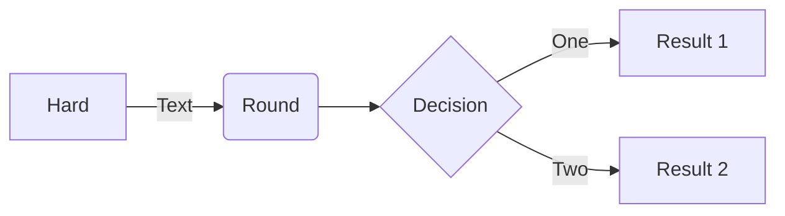
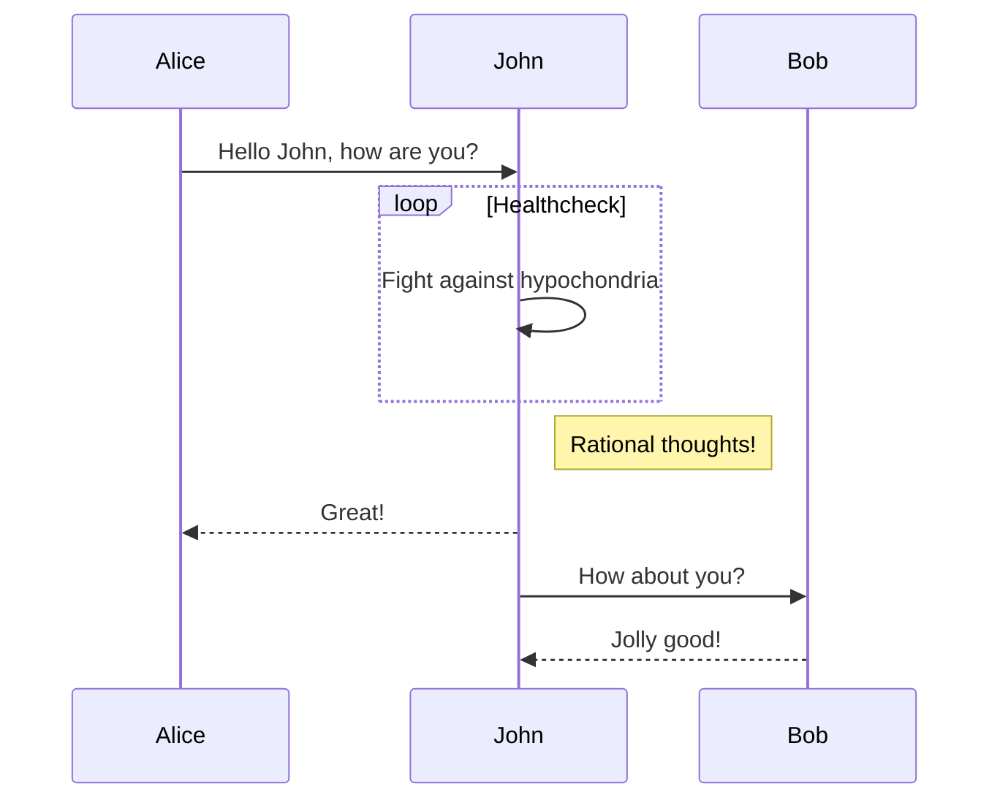
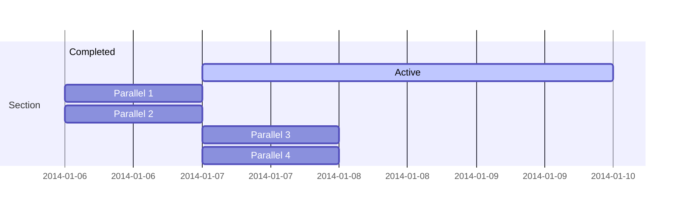
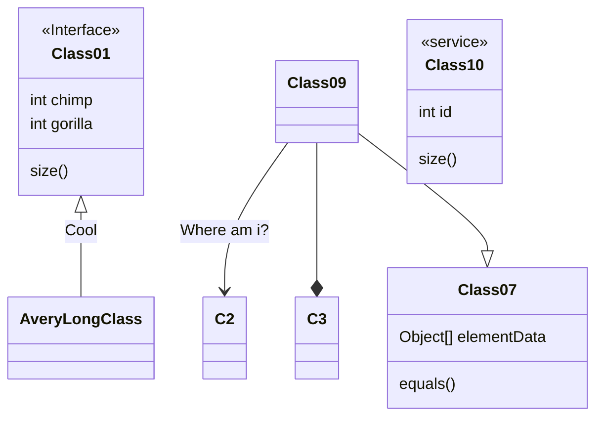
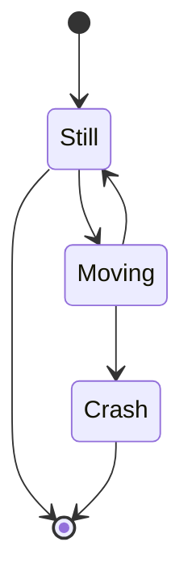
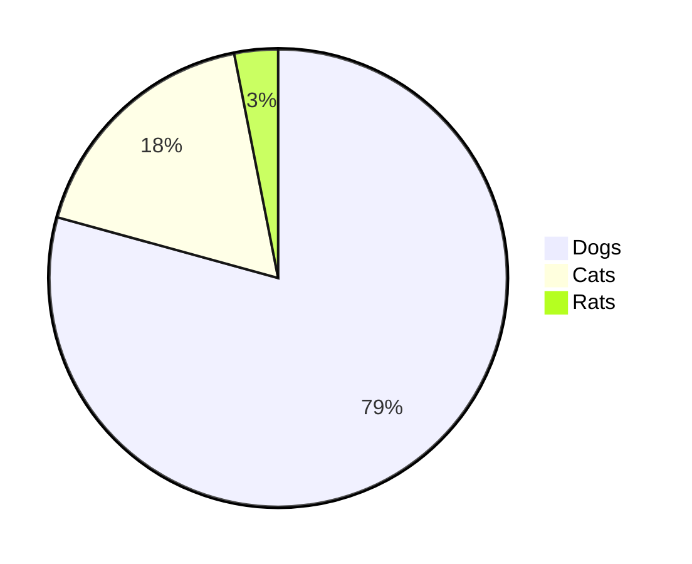
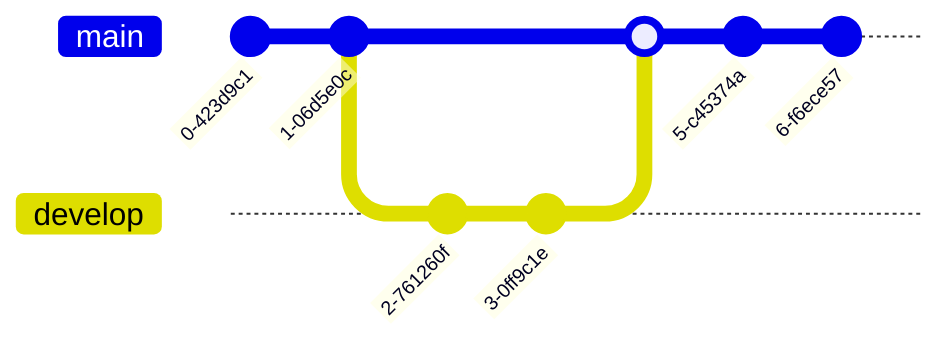
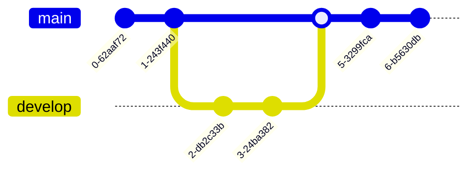
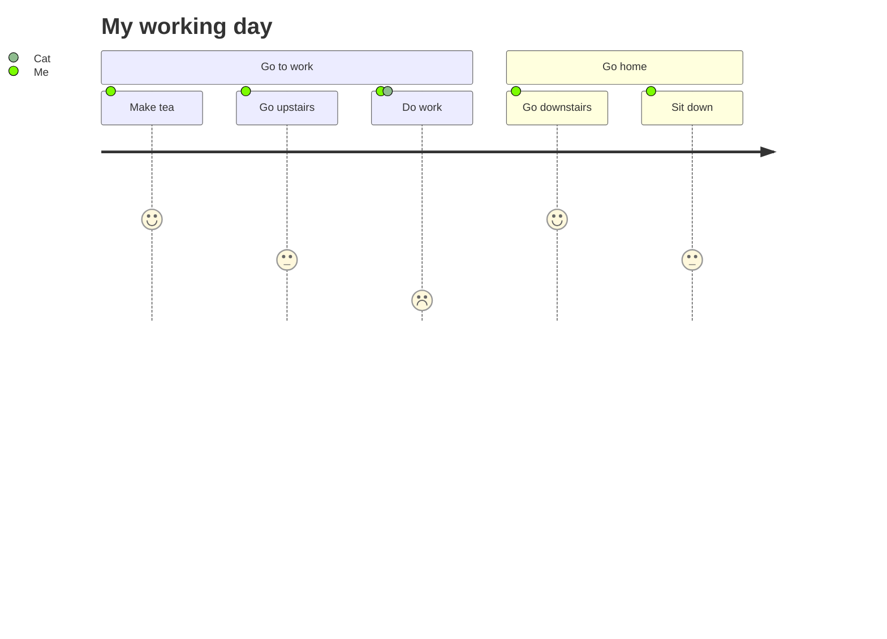

# Markdown

- 텍스트 기반의 markup 언어
- 쉽게 쓰고 읽을 수 있으며 HTML로 변환이 가능함
- 특수기호와 문자를 이용한 간단한 구조의 문법을 사용
- github 덕분에 각광받기 시작함

- 장점
    1. 간결함
    2. 별도의 도구없이 작성 가능
    3. 다양한 형태로 변환 가능
    4. Text로 저장되기 때문에 용량이 적어 보관이 용이함
    5. Text file이기 때문에 version 관리 system을 이용한 변경 이력을 관리가 가능함
    6. 지원하는 program과 platform이 다양함

- 단점
  1. 표준이 없음
  2. 표준이 없기 때문에 도구에 따라서 변환 방식이나 생성물이 다름
  3. 모든 HTML markup을 대신하지 못함

# 문법

## Headers

- 글머리: 1에서 6까지만 지원

```
# This is a H1
## This is a H2
### This is a H3
#### This is a H4
##### This is a H5
###### This is a H6
```
# This is a H1
## This is a H2
### This is a H3
#### This is a H4
##### This is a H5
###### This is a H6
####### This is a H7(지원하지 않음)

## BlockQuote

- email에서 사용하는 ```>``` block 인용 문자를 이용
```
> This is a first blockqute.
> > This is a second blockqute.
> > > This is a third blockqute.
```
> This is a first blockqute.
> > This is a second blockqute.
> > > This is a third blockqute.

이 안에서는 다른 markdown 요소를 포함할 수 있음

> ### This is a H3
> - List
>   ```
>   code
>   ```

## 목록

### 순서있는 목록(번호)

- 순서있는 목록은 숫자와 점을 사용한다.

```
1. 첫번째
2. 두번째
3. 세번째
```
1. 첫번째
2. 두번째
3. 세번째

- 어떤 번호를 입력해도 순서는 내림차순으로 정의됨

```
1. 첫번째
3. 세번째
2. 두번째
```
1. 첫번째
3. 세번째
2. 두번째

### 순서없는 목록(글머리 기호: `*`, `+`, `-` 지원)

```
* 빨강
    * 녹색
        * 파랑

+ 빨강
    + 녹색
        + 파랑

- 빨강
    - 녹색
        - 파랑
```
* 빨강
    * 녹색
        * 파랑

+ 빨강
    + 녹색
        + 파랑

- 빨강
    - 녹색
        - 파랑

혼합해서 사용하는 것도 가능함

```
* 1단계
    - 2단계
        + 3단계
            + 4단계
```

* 1단계
    - 2단계
        + 3단계
            + 4단계

## Code

4개의 공백 또는 하나의 탭으로 들여쓰기를 만나면 변환되기 시작하여 들여쓰지 않은 행을 만날때까지 변환이 계속된다.

### 들여쓰기

```
This is a normal paragraph:

    This is a code block.
    
end code block.
```

- 적용예

    *****
    This is a normal paragraph:

        This is a code block.

    end code block.
    *****


> 한줄 띄어쓰지 않으면 인식이 제대로 안되는 문제가 발생함

```
This is a normal paragraph:
    This is a code block.
end code block.
```

적용예:

*****
This is a normal paragraph:
    This is a code block.
end code block.
*****

### Code Block

- code block은 2가지 방식을 사용할 수 있음

#### `<pre><code>{code}</code></pre>` 이용 방식

```
<pre>
<code>
public class BootSpringBootApplication {
    public static void main(String[] args) {
        System.out.println("Hello, Honeymon");
    }
}
</code>
</pre>
```

<pre>
<code>
public class BootSpringBootApplication {
    public static void main(String[] args) {
        System.out.println("Hello, Honeymon");
    }
}
</code>
</pre>

#### code block code("\```") 을 이용하는 방법

<pre>
<code>
```
public class BootSpringBootApplication {
    public static void main(String[] args) {
        System.out.println("Hello, Honeymon");
    }
}
```
</code>
</pre>

```
public class BootSpringBootApplication {
    public static void main(String[] args) {
        System.out.println("Hello, Honeymon");
    }
}
```

#### Github에서는 code block code("\```") 시작점에 사용하는 언어를 선언하여 문법강조(Syntax highlighting)가 가능함

<pre>
<code>
```java
public class BootSpringBootApplication {
    public static void main(String[] args) {
        System.out.println("Hello, Honeymon");
    }
}
```
</code>
</pre>

```java
public class BootSpringBootApplication {
    public static void main(String[] args) {
        System.out.println("Hello, Honeymon");
    }
}
```


## 수평선 ```<hr/>```

- 아래 줄은 모두 수평선을 만듬
- markdown 문서를 미리보기로 출력할 때 '페이지 나누기' 용도로 많이 사용함

```
* * *

***

*****

- - -

---------------------------------------
```

* 적용예
* * *

***

*****

- - -

---------------------------------------


## Link

* 참조 link

```
[link keyword][id]

[id]: URL "Optional Title here"

// code
Link: [Google][googlelink]

[googlelink]: https://google.com "Go google"
```

Link: [Google][googlelink]

[googlelink]: https://google.com "Go google"

* 외부 link
```
사용문법: [Title](link)
적용예: [Google](https://google.com, "google link")
```
Link: [Google](https://google.com, "google link")

* 자동 연결
```
일반적인 URL 혹은 이메일주소인 경우 적절한 형식으로 링크를 형성한다.

* 외부 link : <http://example.com/>
* email link : <address@example.com>
```

* 외부 link : <http://example.com/>
* email link : <address@example.com>


## 강조

```
*single asterisks*
_single underscores_
**double asterisks**
__double underscores__
~~cancelline~~
```

* *single asterisks*
* _single underscores_
* **double asterisks**
* __double underscores__
* ~~cancelline~~

> ```문장 중간에 사용할 경우에는 **띄어쓰기** 를 사용하는 것이 좋다.```   
> 문장 중간에 사용할 경우에는 띄어쓰기를 사용하는 것이 좋다.


## 줄바꿈

3칸 이상 띄어쓰기(` `)를 하면 줄이 바뀜

```
* 줄 바꿈을 하기 위해서는 문장 마지막에서 3칸이상을 띄어쓰기해야 한다. 
이렇게

* 줄 바꿈을 하기 위해서는 문장 마지막에서 3칸이상을 띄어쓰기해야 한다.___\\ 띄어쓰기
이렇게
```

* 줄 바꿈을 하기 위해서는 문장 마지막에서 3칸이상을 띄어쓰기해야 한다. 이렇게

* 줄 바꿈을 하기 위해서는 문장 마지막에서 3칸이상을 띄어쓰기해야 한다.    
이렇게

---

# Mermaid

- Markdown 문법으로 diagram을 그려주는 library

---

## Flowchart



<pre>

</pre>

---

## Sequence diagram



<pre>

</pre>
- 위의 ```loop```는 ```alt```, ```opt```로 바꿔서 rectangle container를 생성할 수도 있음

---

## Gantt chart



<pre>

</pre>

---

## Class diagram



<pre>

</pre>

---

## State diagram



<pre>

</pre>

---

## Pie chart



<pre>

</pre>

---

## Git graph



<pre>

</pre>

---

## User Journey diagram 



<pre>

</pre>

---

# Reference

- https://gist.githubusercontent.com/ihoneymon/652be052a0727ad59601/raw/279d94f6cb00772e812ded20f0a17b2a3761a7a1/how-to-write-by-markdown.md
    - 기본 문법
- https://github.com/mermaid-js/mermaid#sequence-diagram-docs---live-editor
    - mermaid (graph)